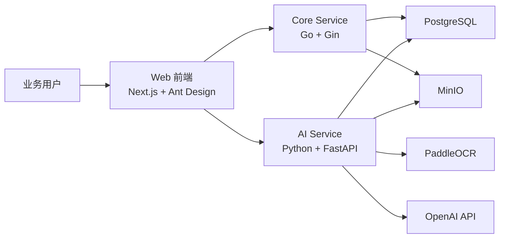

# IFRS 16 管理系统 MVP 技术架构方案

## 1. MVP 建设目标

MVP 阶段目标不是一次性覆盖全部 IFRS 16 场景，而是优先打通最关键的端到端链路：

- 文件上传
- OCR / 文档解析
- AI 字段抽取
- 合同草稿 / 付款计划草稿生成
- 人工确认
- 正式入库
- 基础 IFRS 16 计量
- 基础查询与审计留痕

MVP 阶段应优先保证：

- 核心链路可用
- 数据结构稳定
- 会计逻辑正确
- 后续可扩展到复杂变更和披露

## 2. 推荐 MVP 技术栈

- 前端：Next.js + TypeScript + Ant Design
- 核心后端：Golang + Gin
- 数据访问：pgx + sqlc + goose
- 数据库：PostgreSQL
- AI / 文档解析服务：Python + FastAPI
- OCR / 文档结构化：PaddleOCR
- 大模型能力：OpenAI API
- 对象存储：MinIO
- 认证授权：Go 自建 JWT + 基础 RBAC
- 监控排障：slog + pprof + 基础 metrics
- 部署：Docker

## 3. MVP 架构分层

### 3.1 Web 前端

负责：

- 合同台账页面
- 文件上传页面
- AI Agent 聊天窗口
- 合同草稿确认页面
- 付款计划确认页面
- 基础查询与下载页面

### 3.2 Core Service

使用 Golang 实现，负责：

- 用户登录与权限校验
- 合同主数据管理
- 付款计划管理
- 事件管理
- IFRS 16 基础计量
- 合同草稿转正式台账
- 审计日志

### 3.3 AI Service

使用 Python 实现，负责：

- 接收文件解析请求
- 调用 PaddleOCR
- 解析 PDF、Excel、scan copy
- 调用 LLM 提取结构化字段
- 生成合同草稿、付款计划草稿、事件草稿
- 返回字段级置信度和原文定位

### 3.4 PostgreSQL

负责：

- 存正式业务数据
- 存 AI 草稿数据
- 存任务状态
- 存审核记录
- 存系统日志索引

### 3.5 MinIO

负责：

- 存原始上传文件
- 存合同附件
- 存 OCR 中间产物
- 存解析后的文本和结构化结果文件

## 4. MVP 逻辑架构图

## 5. MVP 核心业务链路

### 5.1 链路一：新合同上传并生成合同草稿

1. 用户上传 PDF / scan copy / Excel
2. 文件写入 MinIO
3. Core Service 创建 AI 任务记录
4. AI Service 拉取任务并执行 OCR / 解析
5. AI Service 抽取合同字段和付款计划
6. 生成合同草稿与字段置信度
7. 用户在前端确认和修正草稿
8. 审批后写入正式合同台账
9. Core Service 触发基础计量

### 5.2 链路二：上传租金表并生成付款计划

1. 用户上传 Excel 或 PDF 租金表
2. AI Service 抽取期间、金额、付款日、先付/后付
3. 生成付款计划草稿
4. 用户批量确认
5. 写入付款计划表
6. 触发重算

### 5.3 链路三：AI 聊天问答

1. 用户在聊天窗口提问
2. Core Service 根据权限确定可访问范围
3. AI Service 基于合同、草稿、附件和台账内容回答
4. 返回引用来源和原文定位

## 6. MVP 范围

### 6.1 第一阶段建议纳入

- 用户登录
- 基础角色权限
- 合同录入和查询
- 文件上传和附件管理
- AI 合同识别
- AI 付款计划识别
- 人工确认草稿
- 正式入库
- 固定租金基础 IFRS 16 计量
- 先付 / 后付逻辑
- 免租期处理
- 基础月度摊销表
- 基础审计日志

### 6.2 第一阶段建议暂不纳入

- 复杂 modification
- reassessment
- CPI / index 自动更新
- sublease
- impairment
- restoration cost 全量自动化
- 披露报表全覆盖
- 多级复杂审批流
- Keycloak
- Temporal
- OpenTelemetry 全链路追踪
- Prometheus + Grafana 完整监控面板

## 7. MVP 数据表建议

- users
- roles
- permissions
- stores
- legal_entities
- landlords
- lease_contracts
- lease_contract_attachments
- lease_payment_schedules
- lease_events
- ai_tasks
- ai_uploaded_files
- ai_contract_drafts
- ai_payment_schedule_drafts
- audit_logs

## 8. MVP 鉴权方案

MVP 阶段不建议先上 Keycloak，可采用轻量方案：

- 用户名密码登录
- JWT token
- 基础 RBAC
- 按法人、门店、角色控制访问权限

典型角色建议：

- 财务录入
- 财务复核
- 财务审批
- IT 管理员
- 审计只读

## 9. MVP 监控与排障方案

MVP 阶段建议采用轻量监控方案：

- 结构化日志：slog
- 请求链路 request_id
- 错误日志分级
- Go pprof 性能分析
- 基础 /health 接口
- 预留 /metrics 接口

重点监控内容：

- 文件上传失败率
- OCR 失败率
- AI 字段抽取失败率
- 合同草稿生成耗时
- 正式入库失败率
- IFRS 16 重算失败率

## 10. MVP 部署建议

MVP 阶段采用 Docker 即可，不必一开始引入复杂容器编排平台。建议部署为以下容器：

- web
- core-service
- ai-service
- postgres
- minio

如需反向代理，可增加：

- nginx

## 11. MVP 成功标准

MVP 上线后，建议以以下标准判断是否成功：

- 用户可上传合同和租金表
- AI 可生成可用的合同草稿和付款计划草稿
- 财务用户可完成确认并写入正式台账
- 系统可输出基础摊销结果
- 核心操作有日志留痕
- 基础权限生效
- 上传到入库全链路可稳定运行
