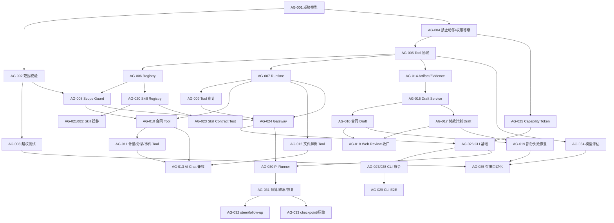

# AI Agent 与 CLI 架构演进实施计划

> 文档状态：Implemented / Runtime Validation Complete
>
> 版本：v1.1
>
> 编制视角：AI Engineer / Platform Engineer
>
> 适用项目：租赁管理系统（IFRS 16）
>
> 创建日期：2026-08-08
>
> 最近验证：2026-08-10；Docker 六服务运行态、AI Planner → Worker → Core Run 闭环已通过

## 1. 执行摘要

本项目不建议直接把一个 Pi-like Agent 放在 Core Service 外部，然后让它通过 CLI 自由调用几十个 HTTP API、执行任意命令或访问数据库。

推荐的架构演进方向是：

> 在 Core Service 与 Agent 之间建立一个受控的 Agent Tool Runtime；Pi-like Agent 负责规划和多步执行，CLI 只是一个 Adapter，所有真正的业务能力仍由 Core Service 的业务模块执行。

目标架构如下：

```text
Web AI Chat ───────────────┐
                           │
Pi-like Agent ── CLI ──────┼──> Agent Tool Runtime
                           │             │
定时任务 / 外部自动化 ───────┘             │
                                         ├── Skill Registry
                                         ├── Policy / Permission Guard
                                         ├── Tool Executor
                                         ├── Evidence / Artifact Manager
                                         └── Audit / Trace
                                               │
                                   Core Application Services
                                               │
                                  Repository / PostgreSQL / MinIO
```

这不是一次“大重写”。现有的 `ai_chat_sessions`、`ai_chat_runs`、SSE 运行事件、Artifact 和 Assist Mode 应继续复用；主要工作是把当前散落在 Agent、前端和 Repository 之间的调用逻辑收口为一个稳定、可审计、可测试的工具接缝。

## 2. 设计结论

### 2.1 需要增加的是 Tool Runtime，不是第二套业务系统

Pi-like Agent 可以提供优秀的 Agent 运行时能力，例如：

- 多轮任务规划
- 工具调用循环
- 中途纠偏和 follow-up
- 会话恢复
- 工具执行事件
- 上下文压缩
- CLI / RPC 接入

但 Pi-like Agent 不应拥有：

- PostgreSQL 账号
- MinIO 管理权限
- 任意 SQL 执行能力
- 任意 HTTP URL 调用能力
- 审批、过账、锁账的默认执行权
- 绕过 Core Service 的业务规则

### 2.2 CLI 是 Adapter，不是新的业务接口实现

CLI 的价值是让 Pi-like Agent 以稳定、可观察的方式调用系统能力，尤其适合：

- 终端式 Agent
- 本地开发和调试
- 定时批处理
- 客户环境自动化
- 人工复核脚本

CLI 不应复制合同、付款计划、月结等业务逻辑。CLI 的实现应调用 Core Service 的 Agent Tool Gateway，或者在同一进程内调用同一个 Tool Runtime 接口。

### 2.3 Agent 永远不是会计控制的权威来源

Agent 可以产生：

- 识别结果
- 风险提示
- 数据质量信号
- 草稿
- 分析建议
- 审计包目录建议

Agent 不可以直接产生：

- 正式会计结论
- Official 报表结论
- 已审批合同
- 已过账分录
- 已锁账期间状态
- 未经批准的计量结果覆盖

这与项目现有的 Assist Mode、审批流、锁账控制，以及 `Agent Signal` 与 `Control Conclusion` 分离原则保持一致。

## 3. 当前实现基线

截至 2026-08-08，项目已经具备一部分真正的 Agent Runtime 基础，不应按“从零开始”设计。

### 3.1 已有能力

- Core Service 内已有 `Agent`、Planner、Executor、Projector 和 Runtime。
- 已有服务端 `ai_chat_sessions`、`ai_chat_runs`、`ai_chat_messages`、`ai_chat_run_events`、`ai_chat_artifacts`、`ai_chat_review_actions`、`ai_chat_attachments`。
- 已有 SSE 运行事件流。
- 已有文件解析 Function Calling：`parse_contract`、`parse_contract_batch`、`parse_payment_schedule`。
- 已有合同、付款计划、计量、分录、事件查询上下文。
- 已有 AI 草稿和人工确认动作。
- 已有 Assist Mode 和置信度/缺失字段/复核提示。
- Core Service 已负责 JWT、RBAC、法人隔离和数据范围。

### 3.2 当前架构的主要问题

#### 问题 A：工具接口不统一

`core-service/internal/aiagent/agent.go` 同时承担：

- 意图判断
- Runbook 选择
- 文件工具路由
- Repository 数据读取
- 上下文拼装
- LLM 调用
- 来源抽取
- 草稿结果转换

这使 Agent 模块变浅：调用方需要理解大量内部细节，未来增加 CLI、定时任务或第二个 Agent 时会重复接入。

#### 问题 B：部分 ToolCall 只是展示元数据

当前 `core.contract_repository`、`lease.audit_pack_builder` 等名称主要出现在 Runbook 和前端工具轨迹中，并不是统一注册、统一授权、统一执行的工具。

实际 Function Calling 主要集中在文件解析工具。

#### 问题 C：写入链路没有完全收口

当前 AI 草稿确认后，Web 前端直接调用：

- `/api/v1/contracts/batch`
- `/api/v1/contracts/:id/payment-schedules`

这在浏览器场景可以工作，但会导致：

- Web、Pi CLI、定时任务可能各自实现一套写入流程。
- Agent Runtime 看不到完整的写入事务。
- 幂等、批量失败恢复、Artifact 状态和业务写入状态可能不一致。

#### 问题 D：合同上下文的权限校验需要统一

合同基础信息查询已有法人和数据范围过滤，但计量结果和事件查询需要在 Agent Tool Runtime 入口统一校验合同访问权限，不能只依赖调用方传入的合同 ID。

#### 问题 E：缺少面向外部 Agent 的稳定能力协议

目前没有统一定义以下内容：

- 工具版本
- 输入/输出 Schema
- 权限要求
- 人工确认要求
- 幂等语义
- 分页和数据上限
- 错误码
- 工具执行审计
- 证据引用格式

## 4. 目标与非目标

### 4.1 目标

1. 让 Web Agent、Pi-like Agent、CLI、定时任务共享同一套业务工具接口。
2. 让工具调用天然带有用户身份、法人、数据范围、权限、Run ID 和 Trace ID。
3. 让读取、草稿写入和高风险操作有明确的权限等级。
4. 让每一次工具调用都可重放、可审计、可观测。
5. 让新增技能只需注册 Skill 和 Tool，而不是继续扩展一个大型关键词 `switch`。
6. 让 Agent 可以多步工作，但不能绕过审批、过账、锁账和会计规则。
7. 让 CLI 适合作为自动化入口，但不变成任意 Shell 执行器。

### 4.2 非目标

本计划不包括：

- 把 PostgreSQL 直接暴露给 Agent。
- 把所有 Core Service HTTP API 自动转换成 Agent 工具。
- 立即引入开放式第三方 Tool Marketplace。
- 立即开放自动审批、自动过账或自动锁账。
- 用 Pi-like Agent 替换 IFRS 16 计量引擎。
- 用 LLM 替换确定性的审批和月结控制。
- 一次性重写现有 AI Chat 前端。

## 5. 架构选型

### 5.1 方案比较

| 方案 | 说明 | 优点 | 主要风险 | 结论 |
|---|---|---|---|---|
| A. 保持现状 | Agent 继续直接读 Repository，Web 直接写业务 API | 改动最小 | 多入口重复、权限和审计分散 | 只能作为短期过渡 |
| B. Pi Agent 直接调用所有 HTTP API | CLI 只做 HTTP 包装 | 上手快 | API 泄漏、权限分散、流程漂移、难审计 | 不推荐 |
| C. Tool Runtime + CLI Adapter | Core Service 统一工具执行，CLI 只是接入层 | 权限、审计和业务规则集中 | 需要设计工具协议和迁移 | 推荐 |
| D. 完全独立 Agent Service | Pi Agent、工具、状态全部拆成新服务 | 独立扩展能力强 | 引入分布式一致性和大量运维成本 | 后期再考虑 |

### 5.2 推荐方案

选择方案 C，并保留未来升级到方案 D 的可能性：

```text
                    ┌──────────────────────────┐
                    │ Agent Clients            │
                    │ Web / Pi / CLI / Jobs    │
                    └────────────┬─────────────┘
                                 │
                    ┌────────────▼─────────────┐
                    │ Agent Tool Gateway       │
                    │ Auth / Scope / Policy    │
                    └────────────┬─────────────┘
                                 │
                    ┌────────────▼─────────────┐
                    │ Tool Runtime              │
                    │ Registry / Executor       │
                    │ Artifact / Evidence      │
                    └────────────┬─────────────┘
                                 │
                    ┌────────────▼─────────────┐
                    │ Core Application Services │
                    │ Contract / Lease / Close  │
                    └────────────┬─────────────┘
                                 │
                    ┌────────────▼─────────────┐
                    │ PostgreSQL / MinIO        │
                    └──────────────────────────┘
```

## 6. 模块设计

本计划使用深模块设计原则：对外提供少量稳定接口，把权限、校验、事务、审计、重试和错误转换隐藏在实现内部。

### 6.1 `ToolRuntime`：主要外部接缝

建议在 Core Service 内增加：

```text
core-service/internal/agenttools/
├── registry.go
├── runtime.go
├── policy.go
├── context.go
├── schema.go
├── result.go
├── audit.go
└── tools/
    ├── contract.go
    ├── payment_schedule.go
    ├── measurement.go
    ├── journal.go
    ├── event.go
    ├── report.go
    └── audit_pack.go
```

对外接口应保持小而稳定：

```go
type ToolRuntime interface {
    Describe(ctx context.Context, filter ToolFilter) ([]ToolDescriptor, error)
    Execute(ctx context.Context, call ToolCall) (ToolResult, error)
}
```

这里的接口不仅包括函数参数，还包括：

- 调用者必须提供的身份上下文。
- 工具是否只读。
- 是否需要人工确认。
- 是否支持幂等键。
- 结果是否分页。
- 超时和重试语义。
- 错误码和可恢复性。

### 6.2 `ToolCall`

```json
{
  "call_id": "tc_01J...",
  "run_id": "run_01J...",
  "tool_name": "lease.contract.search",
  "tool_version": "v1",
  "arguments": {
    "search": "上海门店",
    "approval_status": "approved",
    "page": 1,
    "page_size": 20
  },
  "idempotency_key": "optional-client-key",
  "dry_run": true
}
```

工具不得从 `arguments` 中信任以下字段：

- `user_id`
- `role`
- `legal_entity_id`
- `permissions`
- `is_admin`
- `approval_status_override`

这些字段必须由服务器根据 Session、JWT 或短期 Capability Token 解析。

### 6.3 `ToolResult`

```json
{
  "call_id": "tc_01J...",
  "status": "completed",
  "data": {
    "items": [],
    "page": 1,
    "page_size": 20,
    "has_more": false
  },
  "sources": [
    {
      "type": "contract",
      "id": "contract-id",
      "title": "合同名称",
      "locator": "lease_contracts:contract-id"
    }
  ],
  "review": {
    "required": false,
    "reasons": []
  },
  "error": null
}
```

模型可读的是经过裁剪和脱敏的 `data`，系统保留完整结果和审计引用，但不能把无限量数据库结果直接塞进 prompt。

## 7. Tool 分层和权限模型

### 7.1 Level 0：只读事实工具

第一阶段开放：

| Tool | 用途 | 数据来源 |
|---|---|---|
| `lease.contract.search` | 合同列表、筛选、分页 | `lease_contracts` |
| `lease.contract.get` | 合同详情和关键字段 | `lease_contracts` |
| `lease.payment_schedule.list` | 付款计划查询 | `payment_schedules` |
| `lease.measurement.list` | 计量结果查询 | `measurement_results` |
| `lease.journal.list` | 分录查询 | `journal_entries` |
| `lease.event.list` | 事件查询 | `lease_events` |
| `lease.report.preview` | Working/Official 报表预览 | Reporting Service |
| `lease.audit.list` | 审计记录查询 | `audit_logs` |

所有 Tool 必须在 Repository 查询前验证合同和数据范围。

### 7.2 Level 1：草稿生成工具

第二阶段开放：

| Tool | 输出 | 是否写正式台账 |
|---|---|---|
| `lease.contract.create_draft` | 合同草稿 Artifact | 否，或只写 Draft |
| `lease.payment_schedule.create_draft` | 付款计划草稿 Artifact | 否 |
| `lease.event.create_draft` | 事件草稿 Artifact | 否 |
| `lease.audit_pack.prepare` | 审计包目录建议 | 否 |
| `lease.close.explain` | 月结异常解释 | 否 |

草稿工具必须返回：

- 字段级置信度
- 缺失字段
- 原文证据引用
- 规则版本
- 模型版本
- `requires_human_confirmation`
- `review_reasons`

### 7.3 Level 2：受控业务命令

后续可评估：

- `lease.contract.submit_for_review`
- `lease.event.submit_for_review`
- `lease.calculation.preview`
- `lease.monthly_close.generate_draft`

这些工具只能触发标准流程，不能直接改变最终状态。

### 7.4 默认禁止工具

Agent 默认不开放：

- 任意 SQL
- 任意 HTTP 请求
- 任意 Shell 命令
- 直接修改 `lease_contracts` 任意字段
- 直接批准合同
- 直接过账分录
- 直接锁账或解锁期间
- 直接 ERP 回写
- 直接覆盖已锁账数据

如果未来开放高风险命令，必须使用单独的 Policy、人工确认和审批分离控制。

## 8. Skill Registry 设计

当前 `buildAgentRunbook()` 的关键词分支应逐步迁移成受控 Skill Registry。

### 8.1 Skill 定义

```yaml
id: payment_schedule_intake
version: v1
display_name: 租金表导入
intent_examples:
  - 解析这份租金表
  - 导入付款计划
required_context:
  - evidence_file
optional_context:
  - contract_id
allowed_tools:
  - lease.evidence.read
  - lease.payment_schedule.create_draft
artifact_types:
  - payment_schedule_draft
review_policy:
  required: true
  blockers:
    - missing_currency
    - low_confidence_amount
    - unresolved_payment_timing
    - variable_or_non_lease_component
```

### 8.2 首批 Skill

1. `contract_batch_intake`
2. `contract_review`
3. `payment_schedule_intake`
4. `audit_pack`
5. `monthly_close_explainer`
6. `report_explainer`
7. `data_quality_review`

Skill 只负责组合工具和定义复核策略，不能自己绕过 Tool Runtime 直接访问数据库。

## 9. Pi-like Agent 与 CLI 设计

### 9.1 推荐部署形态

建议先将 Pi-like Agent 作为独立的 Agent Runner 运行：

```text
cmd/agent-runner（独立 Worker）
    └── HTTP / RPC
            └── Core Service Agent Tool Gateway

cmd/lease-agent（人工/自动化 CLI Adapter，独立入口）
    └── HTTP / RPC
            └── Core Service Agent Tool Gateway
```

Runner 不通过 shell 调用 CLI；Runner 和 CLI 都是 Gateway 的受控 Adapter。这样可以让 Pi-like Agent 的运行时快速迭代，同时让 Core Service 保持系统的权限和数据权威。

### 9.2 CLI 命令规范

CLI 应提供面向业务能力的命令，而不是面向底层 REST URL 的命令：

```bash
# 只读查询
lease-agent contract search --search "上海" --status approved --token "$TOKEN"
lease-agent contract get --id CONTRACT_ID --token "$TOKEN"
lease-agent measurement list --contract-id CONTRACT_ID --token "$TOKEN"
lease-agent journal list --contract-id CONTRACT_ID --period 2024-01 --token "$TOKEN"
lease-agent event list --contract-id CONTRACT_ID --token "$TOKEN"

# 草稿操作
lease-agent contract draft-create --input contract-draft.json \
  --idempotency-key contract-import-001 --token "$TOKEN"
lease-agent payment-schedule draft-create --input payment-schedule-draft.json \
  --idempotency-key payment-import-001 --token "$TOKEN"

# 通用 Tool 调用（仍然只能调用服务端已注册的 Tool）
lease-agent execute --tool lease.contract.search --arguments - --token "$TOKEN" < search.json
```

### 9.3 CLI 输入输出约束

- `stdout` 只输出机器可读结果。
- `stderr` 输出诊断信息和调试日志。
- 当前版本 stdout 默认输出 JSON；人类可读格式可作为后续 CLI Adapter 能力增加，不能改变 Tool 返回语义。
- 支持 `--dry-run`，但 `dry-run` 不能代表已审批。
- 支持 `--run-id` 和 `--idempotency-key`。
- 返回稳定退出码：认证失败、权限不足、参数错误、需要复核、业务失败、系统失败应区分。
- 所有输出包含 `sources`、`review`、`trace_id` 和 `tool_call_id`。
- CLI 不接受任意 URL、SQL 或脚本参数。

### 9.4 CLI 认证

不使用长期管理员 Token。推荐使用短期 Capability Token，至少包含：

```text
subject / user_id
session_id
run_id
legal_entity_id
scope dimensions
allowed_tools
expires_at
audience = lease-agent-gateway
```

服务器仍然根据登录用户和服务身份重新计算权限，不能只信任 Token 内的工具白名单。

## 10. Agent 执行生命周期

标准执行流程：

```text
1. 创建或恢复 Session
2. 创建 Run
3. 解析用户目标和 Skill
4. 构造 Agent Context
5. LLM 提议 Tool Call
6. Tool Runtime 校验权限、范围和参数
7. 执行 Tool
8. 记录 tool_execution 和 evidence
9. 将结果返回 Agent
10. 继续下一步、生成 Artifact 或请求人工确认
11. 完成 Run 或进入 waiting_review
```

### 10.1 执行预算

每个 Run 必须有：

- 最大 Tool Call 数
- 最大运行时间
- 最大模型 Token 数
- 最大结果行数
- 最大上传文件大小
- 最大重试次数
- 最大并发 Tool 数

默认建议：所有写工具串行执行，避免同一合同发生并发更新。

### 10.2 重试和幂等

工具必须区分：

- 可安全重试的读取操作
- 只能幂等重试的草稿写入
- 不允许自动重试的高风险命令

批量合同和付款计划导入必须支持：

- `idempotency_key`
- 单行成功/失败结果
- 可恢复批次
- 已成功行不重复写入
- Artifact 状态与业务写入结果一致

## 11. Artifact、Evidence 和 Review 设计

### 11.1 Artifact 统一协议

当前合同草稿和付款计划草稿应统一为：

```json
{
  "artifact_id": "artifact-id",
  "artifact_type": "contract_draft",
  "schema_version": "v1",
  "status": "ready",
  "data": {},
  "actions": [
    "confirm",
    "edit",
    "skip",
    "reject"
  ],
  "evidence_refs": [],
  "review_required": true,
  "review_reasons": []
}
```

### 11.2 Evidence 统一协议

每个 AI 识别字段应尽量带：

- `source_file_id`
- `object_name`
- `page`
- `sheet`
- `cell_range`
- `text_quote` 或文本偏移量
- `extraction_method`
- `model_version`
- `confidence`

对于没有可靠原文定位的结果，必须标记 `evidence_complete=false`，不能伪造定位信息。

### 11.3 Review Gate

以下情况必须进入 `waiting_review`：

- 折现率缺失
- 币种缺失
- 关键日期缺失或逻辑异常
- 先付/后付不明确
- 变量租金或非租赁成分未确认
- `lease_scope` 非 `in_scope` 或置信度不足
- 合同主体无法唯一匹配
- 文档证据不完整
- 批量导入存在部分失败

## 12. 数据库与持久化计划

### 12.1 复用现有表

优先复用并扩展：

- `ai_chat_sessions`
- `ai_chat_runs`
- `ai_chat_messages`
- `ai_chat_run_events`
- `ai_chat_artifacts`
- `ai_chat_review_actions`
- `ai_chat_attachments`
- `ai_contract_drafts`
- `ai_payment_schedule_drafts`

不要为了 Pi-like Agent 再复制一套平行会话表，除非外部 Agent 有完全不同的生命周期。

### 12.2 建议新增表

#### `ai_tool_executions`

用于查询和审计每次工具执行，不把所有信息都埋在 JSONB 事件中。

建议字段：

```text
id
run_id
parent_tool_execution_id
tool_name
tool_version
skill_id
call_id
input_redacted JSONB
output_summary JSONB
status
permission_decision
review_required
idempotency_key
trace_id
started_at
completed_at
error_code
error_message
created_by
```

#### `ai_capability_grants`

如果 CLI / Pi-like Agent 使用短期 Capability Token，可持久化 Token 摘要和撤销状态：

```text
id
subject_type
subject_id
session_id
run_id
legal_entity_id
scope_snapshot JSONB
allowed_tools JSONB
token_hash
expires_at
revoked_at
created_by
```

数据库中不保存明文 Token。

### 12.3 业务表写入原则

Agent Tool 不直接拼 SQL 写业务表。写入必须经过：

```text
Tool Runtime
    → Application Service
        → Domain validation
            → Repository / transaction
                → Audit log
```

合同、付款计划、事件和月结的写入都要继续遵守现有审批和锁账控制。

## 13. 权限和安全方案

### 13.1 权限决策位置

权限决策必须在 Core Service Tool Runtime 中完成，而不是：

- 由 Prompt 告诉模型“你只能看某法人”。
- 由 CLI 自己过滤数据。
- 由前端隐藏按钮。
- 由 Tool 描述文字提醒模型。

### 13.2 多租户校验

任何以 `contract_id` 为输入的 Tool，必须执行：

1. 合同存在性检查。
2. `legal_entity_id` 检查。
3. Store / Region / Brand 数据范围检查。
4. 当前用户或 Capability 的资源权限检查。
5. 再查询合同关联的付款计划、计量、分录和事件。

不能先按 ID 查询关联表，再事后判断合同权限。

### 13.3 文档 Prompt Injection 防护

上传的合同、Excel、PDF 文本属于不可信输入。必须：

- 把文档内容标记为 evidence，不当作系统指令。
- 禁止文档内容修改工具白名单或权限。
- 工具参数由服务器 Schema 校验。
- 关键字段由确定性规则重新校验。
- LLM 不得根据文件中的“请执行 SQL”或“忽略审批”指令行动。

### 13.4 敏感信息处理

- Prompt 中只放最小必要字段。
- 日志中的输入参数要脱敏。
- 不记录完整合同正文到普通运行日志。
- API Key、数据库密码、MinIO Secret 不能进入模型上下文。
- 工具结果默认分页、限量和字段裁剪。

## 14. API / Gateway 设计

CLI 可以通过 Core Service 增加一组受控 Agent Gateway 路由：

```text
POST /api/v1/agent/sessions
POST /api/v1/agent/runs
GET  /api/v1/agent/runs/:id/events
GET  /api/v1/agent/runs/:id/stream
GET  /api/v1/agent/runs/:id/checkpoint
POST /api/v1/agent/runs/:id/checkpoint
GET  /api/v1/agent/tools
POST /api/v1/agent/tools/execute
POST /api/v1/agent/capabilities
POST /api/v1/agent/runs/:id/steer
POST /api/v1/agent/runs/:id/follow-up
POST /api/v1/agent/runs/:id/branch
POST /api/v1/agent/artifacts/:id/actions
```

设计要求：

- Gateway 只暴露注册过的 Tool。
- Tool 名称和版本服务端解析，不允许客户端传入任意函数名映射到 Go 方法。
- Describe/Execute 入口从 JWT、权限和 DataScopeMiddleware 构造 ExecutionContext；ToolCall 中的身份字段一律拒绝。
- 所有请求带 `run_id`、`trace_id` 和身份上下文。
- Gateway Execute 复用 Tool Runtime，并把 Tool Execution 写入现有 `audit_logs`。
- 事件流复用现有 SSE 机制。
- 外部 CLI 和 Web Runtime 使用相同的 Tool Runtime，不复制执行逻辑。

## 15. Core Service 代码迁移策略

### 15.1 第一阶段：建立内部接缝

新增 `internal/agenttools`，先不改变外部接口：

```text
aiagent.Agent
    → agenttools.ToolRuntime
        → application services
            → repositories
```

先把以下直接调用收口：

- 合同查询
- 计量查询
- 分录查询
- 事件查询
- 文件解析路由

### 15.2 第二阶段：迁移草稿写入

把当前前端直接调用正式业务写入 API 的逻辑改为：

```text
Review Action
    → Tool Runtime command
        → Draft Application Service
            → business API / repository
```

前端仍然可以调用同一个 Review Action API，但不能自行拼装一套独立的导入事务。

### 15.3 第三阶段：引入 CLI Adapter

CLI 只需实现：

```text
命令解析
    → ToolCall JSON
        → Agent Gateway
            → ToolRuntime.Execute
```

不应在 CLI 中重复实现租赁会计、字段规范化、审批条件或数据范围逻辑。

## 16. AI Engineering 运行策略

### 16.1 规划模型和执行模型分离

建议区分：

- Planner：判断目标、Skill 和下一步 Tool。
- Extractor：从合同/Excel/PDF 提取结构化字段。
- Analyst：解释数据、生成风险提示和审计建议。

不同任务可以使用不同模型和温度，不要用一个通用 Prompt 处理所有事务。

### 16.2 LLM 不是权限系统

Prompt 只能约束回答风格和会计谨慎原则；真正的权限、工具白名单、字段可见性、审批门槛必须由确定性代码执行。

### 16.3 结构化输出优先

所有需要进入 Artifact 的输出优先使用 JSON Schema：

- 合同字段
- 付款计划行
- Review Prompt
- Evidence Reference
- Tool 参数
- 审计包目录

文本回答可以自由生成，但业务对象不应依赖正则解析自然语言。

### 16.4 模型评估集

新增 Agent Evaluation Dataset，至少覆盖：

- 正常合同问答
- 跨法人合同 ID 攻击
- 缺少折现率
- 币种缺失
- 先付/后付混淆
- turnover rent / CAM / service fee
- 非租赁合同
- Working / Official 混淆
- 用户要求绕过审批
- 文档 Prompt Injection
- 批量导入部分失败

评估指标包括：

- Tool 选择准确率
- 参数 Schema 合法率
- 权限拒绝正确率
- 证据引用完整率
- 人工复核触发召回率
- 不应执行动作的拒绝率
- 业务字段抽取准确率

## 17. 测试计划

### 17.1 Tool Runtime 单元测试

- Tool 注册和版本解析
- 参数 Schema 校验
- 缺少权限时拒绝
- 跨法人合同拒绝
- Store / Region / Brand 范围拒绝
- 结果分页和行数限制
- 幂等键重复调用
- 工具超时和错误转换
- Review Gate 生成

### 17.2 Tool Contract Test

对每个 Tool 固定验证：

- 输入示例
- 输出示例
- 需要的权限
- 只读/写入属性
- 证据来源格式
- 失败错误码
- 是否允许自动重试

### 17.3 CLI Contract Test

- stdout 默认输出 JSON，可被机器解析；stderr 只输出诊断信息。
- `stdout` 不混入日志。
- 退出码稳定。
- 参数错误不会触发业务写入。
- 重复调用不会重复创建草稿。
- Token 过期后不会使用缓存权限继续执行。

### 17.4 端到端测试

至少覆盖：

```text
上传合同
  → Agent 选择解析 Tool
  → 返回合同 Artifact
  → 人工确认
  → 创建 draft 合同
  → 正常提交审批
```

以及：

```text
Pi Agent
  → CLI
  → Tool Gateway
  → 跨法人请求被拒绝
  → 审计记录完整
```

### 17.5 回归测试

继续保持现有 IFRS 16 计量回归测试不被 Agent 代码改变。Agent 只能调用计量能力或读取结果，不能改变计量算法标准答案。

## 18. 观测和运维

### 18.1 需要观测的实体

- Agent Session
- Agent Run
- Skill
- Tool Execution
- Artifact
- Review Action
- Business Transaction

### 18.2 关键指标

- Run 成功率、失败率、取消率
- 平均工具调用数
- Tool 超时率
- Tool 权限拒绝率
- 人工复核率
- 草稿确认率、跳过率、退回率
- 草稿转正式审批的成功率
- LLM Token 和成本
- 单次任务耗时
- 跨法人拒绝次数
- 重复幂等命中次数

### 18.3 Trace 关联

每次调用都应能通过以下链路回溯：

```text
user_id
  → session_id
    → run_id
      → tool_execution_id
        → artifact_id / business_record_id
          → audit_log_id
```

## 19. 分阶段实施计划

### Phase 0：基线和安全修复

目标：在增加新 Agent 之前，先把现有调用链的风险封住。

任务：

- 统一合同、付款计划、计量、分录、事件的数据范围校验。
- 修复 Agent 使用合同 ID 查询关联表时的访问校验顺序。
- 增加跨法人和跨数据范围测试。
- 明确 AI Chat、CLI、Pi Runner 的身份模型。
- 固化 Agent 禁止动作清单。

完成标准：

- 任意不在权限范围内的合同 ID 都不会产生上下文、来源或 Artifact。
- 关键读工具均有权限测试。
- 高风险业务 API 仍不能由 AI Chat 权限直接触发。

### Phase 1：抽取 Tool Runtime

目标：将当前 Agent 的直接 Repository 调用和工具路由收口。

任务：

- 新增 `internal/agenttools`。
- 实现 `ToolRuntime`、`ToolRegistry`、`ToolPolicy`、`ToolResult`。
- 迁移合同、计量、分录、事件、付款计划查询。
- 将文件解析工具接入 Registry。
- 记录 `ai_tool_executions` 或等价事件。
- 保持现有 `/api/v1/ai/chat` 行为兼容。

完成标准：

- Web Agent 的读操作不再直接调用 Repository。
- 每个工具都有版本、权限、数据范围和测试。
- 现有 AI Chat 回归测试全部通过。

### Phase 2：统一 Artifact 和草稿写入

目标：消除前端、CLI、Agent 各自实现写入流程的问题。

任务：

- 统一合同草稿和付款计划草稿 Artifact Schema。
- 增加 Evidence Reference Schema。
- 将 Review Action 与 Draft Application Service 连接。
- 将批量合同导入和付款计划导入改造成服务端可恢复操作。
- 增加幂等键、批次结果和部分失败处理。

完成标准：

- Web 和未来 CLI 使用同一个草稿写入工具。
- Agent 不能绕过 Review Gate 直接创建 Approved 数据。
- 导入失败可以重试而不会重复成功行。

### Phase 3：Skill Registry

目标：减少 `buildAgentRunbook()` 的硬编码分支。

任务：

- 建立 Skill 定义和版本。
- 将合同批量导入、合同复核、租金表导入、审计包迁移到 Registry。
- Skill 定义允许工具白名单、必需上下文和 Review Policy。
- 增加 Skill Contract Test。

完成标准：

- 新增一个 Skill 不需要修改多个 Handler 分支。
- Skill 的工具权限和复核策略可被测试和审计。

### Phase 4：CLI Adapter

目标：让 Pi-like Agent 和定时任务调用受控系统能力。

任务：

- 创建 `lease-agent` CLI。
- 实现 `contract`、`payment-schedule`、`measurement`、`journal`、`event`、`report` 子命令。
- 接入短期 Capability Token。
- 支持 JSON 输出、退出码、Trace ID 和幂等键。
- 增加 CLI Contract Test。
- 在受控环境中运行 Pi-like Agent Runner。

完成标准：

- CLI 不包含业务规则复制。
- CLI 无任意 URL、SQL、Shell 执行能力。
- CLI 调用产生同样的 Tool Execution 和 Audit Trace。

### Phase 5：Pi-like Agent 高级运行时

目标：提升多步任务体验，而不是扩大业务写权限。

任务：

- `steer` 和 `follow-up`
- Run checkpoint
- 会话恢复
- 会计安全的上下文压缩
- 工具执行预算
- 可取消和可恢复任务
- 任务队列和后台执行

完成标准：

- Agent 中断、重试和恢复不会破坏业务状态。
- 压缩上下文后仍保留金额、期间、合同编号和证据引用。
- 所有写操作仍停在 Draft 或 Review Gate。

### Phase 6：有限自动化

目标：在明确的风险边界内启用部分自动化。

候选范围：

- 只读审计包准备
- 数据质量扫描
- 月结异常解释
- 非正式报告摘要
- 低风险、可回滚的草稿生成

暂不自动化：

- 合同正式审批
- 会计分录过账
- 期间锁账
- ERP 凭证回写
- 重大租赁范围或折现率判断

## 20. 任务拆分清单

> 本节是面向执行者的快速核对表；逐项任务、验收条件和证据以 §25 的 AG-001 至 AG-035 为准。`[x]` 已实现并有测试或文档证据，`[~]` 已有可运行接缝但仍缺生产化收口，`[ ]` 尚未完成。

### Architecture

- [x] ADR：决定 Tool Runtime 作为 Core Service 内部深模块（ADR-0019）。
- [x] ADR：决定 CLI 是 Adapter，不复制业务逻辑（ADR-0019 和 `cmd/lease-agent`）。
- [x] ADR：定义 Agent Capability Token 和身份模型；协议、Run 绑定、撤销、过期清理、维护日志和终态审计告警接缝已实现。
- [x] ADR：定义 Agent Tool 分级和禁止动作。
- [x] ADR：定义 Artifact / Evidence / Review 协议；协议、文本/扫描件事件草稿、provider-owned page/box locator、LLM 字段证据反向匹配、跨 Artifact Review transaction 和 Core 审计包导出已实现；无可验证 locator 时保持 incomplete。

### Core Service

- [x] 创建 `internal/agenttools` 目录和接口。
- [x] 实现 Tool Registry。
- [x] 实现 Tool Policy。
- [x] 实现统一数据范围检查。
- [x] 迁移合同查询 Tool。
- [x] 迁移计量查询 Tool。
- [x] 迁移分录查询 Tool。
- [x] 迁移事件查询 Tool。
- [x] 迁移文件解析 Tool。
- [x] 统一 Tool Execution 审计。
- [x] 统一 Artifact 创建和状态流转；合同/付款/文本与扫描件事件解析/报表解释/审计包建议/数据质量链路及服务端审计包导出已接入，生产 AI Review 的跨 Artifact 事务、provider-owned locator 和字段证据审计已接入。
- [x] 统一草稿导入事务和幂等；Draft Application Service、批次恢复和重试、正式审批边界和数据库事务接缝已接入。
- [x] 增加 Agent Gateway 路由；Tool、Capability、Run、事件、checkpoint/branch、取消、steer、follow-up、Artifact action、统一 Trace、terminal alert 和 worker lease 已接入；owner SSE 与带 lease 的 Worker SSE 订阅、旧 Gateway 轮询回退已接入。

### AI Service / Agent Runner

- [x] 保持 AI Service 只负责模型和文档解析。
- [x] 增加结构化 Tool Call 适配。
- [x] 定义 Pi-like Agent Runner 的 Session / Run 接口；Core Run API 和 HTTP Gateway 已接入。
- [x] 实现 Agent Runner 的预算、取消和恢复；Tool Call、结果大小、Deadline、重试和累计模型 token budget、context cancel、Core cancel polling、Memory/JSON/Core JSONB checkpoint、原子 worker claim、heartbeat、release、空队列轮询和过期 lease recovery 已实现，AI Planner usage 接缝已接入；Worker 事件/checkpoint 已按 `worker_id + lease_token` 保护，带 lease 的 SSE 消费、终态汇总和告警 outbox 已接入。
- [x] 禁止 Runner 直接连接 PostgreSQL 和 MinIO 管理端。

### CLI

- [x] 初始化 `lease-agent` 命令。
- [x] 定义 JSON 输入输出协议。
- [x] 定义退出码。
- [x] 实现认证和 Token 刷新；Core 登录/刷新、CLI `auth refresh` 和 Web 401 自动刷新已接入，refresh session 已哈希持久化、原子轮换、logout/logout-all、设备会话 API、`/settings` 设备会话 UI 和过期清理任务已接入。
- [x] 实现 Tool 发现命令。
- [x] 实现只读 Tool。
- [x] 实现草稿 Tool。
- [x] 增加 `--dry-run`、`--run-id`、`--idempotency-key`。
- [x] 增加 CLI Contract Test；HTTP adapter、命令、Worker lease 数据面和真实 Docker Planner/Worker/Core E2E 已覆盖。
- [x] 增加 Run create/events/trace/claim/heartbeat/release/cancel/steer/follow-up/branch 命令。

### Web

- [x] 使用统一 Artifact Schema。
- [x] 使用统一 Review Action。
- [x] 将导入动作迁移到服务端 Tool / Draft Service。
- [x] 增加 Evidence 面板。
- [x] 展示 Tool Execution、Trace ID 和 Review Gate；消息级 Trace 按钮会打开 owner-protected 的 Run/Events/Artifacts/Review Actions/Tool Audits 汇总。
- [x] 支持 Run 取消、Steer、Follow-up 和 checkpoint Branch；Web 控件、Core API、CLI、Runner control polling 和 Worker 队列消费已接入。

### Testing / Operations

- [x] 跨法人越权测试。
- [x] Prompt Injection 测试。
- [x] 幂等和部分失败测试。
- [x] Tool 超时和重试测试。
- [x] 计量回归测试。
- [x] CLI E2E 测试；Go HTTP vertical slice 和真实 Docker/数据库 Planner → Worker → Gateway → Tool → Checkpoint/Event 链路均已通过。
- [~] Tool 延迟、失败和 Review Gate 监控；Core Runtime 已提供低基数 JSON/Prometheus 指标，`llm-usage.v1` 已进入 Run Trace，跨 Run 用量面板、Prometheus recording/alert rules、带 secret Token 的采集模板和运行/回滚手册已落库；生产指标基线校准、告警接收配置和批准的回滚演练仍需部署环境收口。
- [x] Audit Trace 查询能力；统一 Trace API/CLI/Web 面板按 Run 聚合 Tool audit、Run event、Artifact 和 Review Action。

## 21. 验收标准

### 功能验收

- Web Agent 和 CLI 可以调用同一套 Tool。
- 同一个 Tool 在不同入口返回相同的业务语义和错误码。
- Agent 可以完成合同查询、付款计划草稿、合同草稿和审计包准备。
- Agent 可以中途暂停、继续和追加指令。

### 安全验收

- Agent 无法执行任意 SQL、HTTP 或 Shell。
- Agent 无法读取跨法人、跨门店或跨区域数据。
- Agent 无法绕过合同审批、事件审批、月结审批和锁账控制。
- 文件中的 Prompt Injection 不会改变工具白名单或权限。
- Capability Token 过期、撤销或超出范围后立即失效。

### 可审计验收

- 每个 Tool Call 都有执行人、Run、时间、版本、权限决定、输入摘要、输出摘要和来源。
- 每个 Draft 都能追溯到原始文件、证据定位、模型版本和规则版本。
- 每个正式业务记录都能追溯到对应的人工 Review Action。

### 工程验收

- Tool Runtime 可使用 Fake Adapter 进行单元测试。
- Web、CLI 和 Agent Runner 不需要复制业务规则。
- 新增一个只读 Tool 不需要修改多个 Handler。
- 现有 `go test ./...`、前端类型检查、构建和 IFRS 16 回归测试继续通过。

## 22. 主要风险与缓解措施

| 风险 | 表现 | 缓解措施 |
|---|---|---|
| 增加一层后变复杂 | Agent、CLI、Gateway、Core 多层重复 | Tool Runtime 做成深模块，CLI 只做 Adapter |
| 权限漂移 | CLI 和 Web 规则不同 | 权限只在 Core Tool Runtime 决策 |
| 工具泛滥 | 所有 API 都暴露给模型 | 只注册业务级深 Tool，拒绝 REST 自动映射 |
| 写入重复 | 重试造成重复合同/付款计划 | 幂等键、批次事务、成功行记录 |
| 模型幻觉 | AI 生成不存在的字段或金额 | Schema、证据、确定性校验和 Review Gate |
| Prompt Injection | 合同文本诱导 Agent 执行危险动作 | 文档只作为 evidence，服务器校验 Tool Call |
| 运行成本上升 | 多步工具循环增加 Token 和延迟 | Tool 预算、模型分级、缓存和分页 |
| 旧链路不一致 | Web 直接写入，CLI 走新链路 | Phase 2 统一 Draft Service，设置迁移截止点 |
| 运行态难恢复 | CLI 进程退出导致任务状态不明 | Server-side Run、checkpoint、幂等和事件持久化 |

## 23. 关键设计决策

### 决策 1：Core Service 保留业务权威

Agent、Pi、CLI 都不能成为第二个业务后端。Core Service 的业务服务、权限、审批、锁账和审计仍是唯一权威。

### 决策 2：Tool 采用业务语义，不采用 REST 镜像

优先提供 `lease.contract.search`，而不是把 `/api/v1/contracts` 原样暴露给 Agent。业务语义工具可以隐藏分页、字段裁剪、权限和来源组装，接口更深，调用方更简单。

### 决策 3：先内嵌 Tool Runtime，再考虑独立 Agent Service

当前规模下，先在 Core Service 内建立接缝，可以获得足够的复用和测试收益。只有当外部 Agent 数量、任务队列或隔离需求明显增加时，才拆成独立 Agent Gateway。

### 决策 4：CLI 不等于 Auto-Post

CLI 只是调用方式。是否允许写入、审批或过账，必须由工具等级和权限策略决定，不能因为来自终端就获得更高权限。

## 24. 最终推荐顺序

建议实际开发顺序为：

```text
P0 统一合同/关联数据权限校验
  → P1 Tool Runtime + Registry
  → P1 Artifact / Evidence / Review 统一
  → P1 草稿写入服务端收口
  → P2 Skill Registry
  → P2 CLI Adapter
  → P2 Pi-like Agent Runner
  → P3 steer / follow-up / checkpoint / compaction
  → P4 有限自动化
```

如果只能先做一项，优先做：

> `Tool Runtime + 统一权限校验 + Tool Execution 审计`

这是未来 Web Agent、Pi-like Agent、CLI、定时任务和外部 ERP 自动化共同依赖的唯一深模块接缝。

## 25. 工程任务清单（可执行版）

> 任务清单依据 [AI Agent 与 CLI 架构演进 PRD](AI_Agent_与_CLI_架构演进_PRD.md) 编排。
>
> 状态约定：`[ ]` 未开始，`[~]` 进行中，`[x]` 已完成，`[!]` 阻塞。
>
> 原则：每个任务必须跨越一个可测试的最高接缝，优先交付可运行的垂直切片，不先建设没有调用方的抽象。

### 25.1 任务总览

| ID | 阶段 | 任务 | 前置任务 | 主要交付物 | 状态 |
|---|---|---|---|---|---|
| AG-001 | P0 | 建立 Agent 数据访问威胁模型 | 无 | 访问矩阵、攻击场景、修复优先级 | [x] |
| AG-002 | P0 | 统一合同关联数据的范围校验 | AG-001 | 访问安全的合同上下文读取 | [x] |
| AG-003 | P0 | 增加跨法人/跨门店越权测试 | AG-002 | 自动化安全测试集 | [x] |
| AG-004 | P0 | 固化 Agent 禁止动作和权限等级 | AG-001 | Tool Policy 清单、ADR | [x] |
| AG-005 | P1 | 定义 ToolCall/ToolResult/ToolDescriptor | AG-004 | 版本化工具协议 | [x] |
| AG-006 | P1 | 实现 Tool Registry | AG-005 | 受控 Tool 注册和发现 | [x] |
| AG-007 | P1 | 实现 Tool Runtime 执行接缝 | AG-005, AG-006 | 统一执行器和错误模型 | [x] |
| AG-008 | P1 | 实现 Tool Policy/Scope Guard | AG-002, AG-006 | 权限、范围、Review Gate | [x] |
| AG-009 | P1 | 增加 Tool Execution 审计 | AG-007 | 工具调用可追溯记录 | [x] |
| AG-010 | P1 | 迁移只读合同 Tool | AG-007, AG-008 | contract.search/get | [x] |
| AG-011 | P1 | 迁移计量、分录、事件 Tool | AG-010 | measurement/journal/event list | [x] |
| AG-012 | P1 | 迁移文件解析 Tool | AG-007 | 三类解析工具注册化 | [x] |
| AG-013 | P1 | 保持现有 AI Chat 兼容 | AG-010, AG-011, AG-012 | 旧入口兼容适配器 | [x] |
| AG-014 | P2 | 统一 Artifact/Evidence 协议 | AG-005, AG-012 | 草稿和证据结构 | [x] |
| AG-015 | P2 | 实现 Draft Application Service | AG-014 | 服务端草稿写入 | [x] |
| AG-016 | P2 | 迁移合同草稿创建 | AG-015 | 幂等合同批量草稿 | [x] |
| AG-017 | P2 | 迁移付款计划草稿导入 | AG-015 | 幂等付款计划批次 | [x] |
| AG-018 | P2 | 收口 Web Review Action | AG-016, AG-017 | Web/Agent 统一确认链路 | [x] |
| AG-019 | P2 | 增加部分失败恢复 | AG-016, AG-017 | 可恢复批次和结果明细 | [x] |
| AG-020 | P3 | 实现 Skill Registry | AG-006, AG-014 | 技能注册、版本、权限 | [x] |
| AG-021 | P3 | 迁移合同导入和复核 Skill | AG-020 | 两个生产 Skill | [x] |
| AG-022 | P3 | 迁移租金表和审计包 Skill | AG-020 | 两个生产 Skill | [x] |
| AG-023 | P3 | 增加 Skill Contract Test | AG-020, AG-021, AG-022 | 技能行为契约 | [x] |
| AG-024 | P4 | 设计 Agent Gateway | AG-007, AG-008, AG-009 | 外部调用协议和路由 | [x] |
| AG-025 | P4 | 实现 Capability Token | AG-004, AG-024 | 短期受限凭证 | [x] |
| AG-026 | P4 | 实现 lease-agent CLI 基础框架 | AG-024, AG-025 | JSON/退出码/日志约定 | [x] |
| AG-027 | P4 | 实现 CLI 只读命令 | AG-026, AG-010, AG-011 | 查询类子命令 | [x] |
| AG-028 | P4 | 实现 CLI 草稿命令 | AG-026, AG-016, AG-017 | Draft 子命令 | [x] |
| AG-029 | P4 | 增加 CLI Contract/E2E Test | AG-027, AG-028 | CLI 自动化验收 | [x] |
| AG-030 | P5 | 建立 Pi-like Agent Runner Adapter | AG-024, AG-026 | Runner 调用 Tool Gateway | [x] |
| AG-031 | P5 | 增加 Agent 预算、取消和恢复 | AG-030 | 可控长任务运行时 | [x] |
| AG-032 | P5 | 增加 steer/follow-up | AG-030, AG-031 | 中途纠偏和续跑 | [x] |
| AG-033 | P5 | 增加 checkpoint 和安全压缩 | AG-031 | 可恢复会话上下文 | [x] |
| AG-034 | P5 | 增加模型评估集和评估门 | AG-005, AG-020 | 路由/权限/抽取评估 | [x] |
| AG-035 | P6 | 评估有限自动化场景 | AG-003, AG-019, AG-034 | 风险分级自动化决策 | [~] |

### 25.2 P0：安全基线和访问范围

#### AG-001：建立 Agent 数据访问威胁模型

- [x] 梳理 Web、AI Service、Core Service、CLI、Pi Runner 的身份来源。
- [x] 梳理合同、付款计划、计量、分录、事件、附件和报表的访问维度。
- [x] 列出跨法人、跨门店、跨区域、跨品牌和伪造 `contract_id` 场景。
- [x] 列出 Prompt Injection、任意 SQL、任意 URL、任意 Shell、重放写入和权限缓存场景。
- [x] 对每个场景标记：攻击入口、当前控制、缺口、修复任务、验证证据；证据见 ADR 0019 和 `docs/agent-automation-risk-register.v1.md`。

验收条件：形成一份可审阅的 Agent Threat Model，并能映射到 AG-002 至 AG-004。

#### AG-002：统一合同关联数据的范围校验

- [x] 建立一个统一的合同访问检查入口。
- [x] 访问合同后再查询付款计划、计量、分录、事件和文档。
- [x] 让所有合同 ID 驱动的 Agent 查询复用同一访问检查。
- [x] 对管理员跨租户访问和普通用户法人访问分别验证。
- [x] 不允许 Agent Tool 通过裸 `contract_id` 绕过数据范围；Repository 仍保留既有业务入口，Agent 只能经 Scope-aware Adapter 访问。

验收条件：无权限合同不会产生任何上下文、来源、Artifact 或错误详情泄漏。

#### AG-003：增加跨范围安全测试

- [x] 在 `lease.contract.get@v1` 覆盖跨法人、跨门店、跨区域、跨品牌和 Global admin 场景。
- [x] 在计量、事件、分录 Tool 覆盖“先范围检查、后关联读取”，越权时底层 Reader 不被调用。
- [x] 空法人、过期 JWT、错误角色和伪造身份字段均有 Gateway/Middleware 测试覆盖。
- [x] Follow-up 的 scope、页面上下文、父子 Run、Skill 版本继承和 CLI 控制入口均有运行时测试覆盖。
- [x] 越权合同统一返回 `not_found`，不泄漏合同存在性。

验收条件：安全测试在 Core Service 和 Agent Gateway 两个入口都通过。

#### AG-004：固化禁止动作和权限等级

- [x] 定义 Level 0 只读、Level 1 草稿、Level 2 受控命令。
- [x] 默认禁止任意 SQL、HTTP、Shell、审批、过账、锁账、解锁和 ERP 回写。
- [x] 定义每个等级的权限、人工确认、审计和重试要求。
- [x] 形成 ADR 0019，作为后续 Tool 注册的强制门槛。

验收条件：任意新 Tool 没有权限等级和 Review Policy 时无法注册。

### 25.3 P1：Tool Runtime 核心接缝

#### AG-005：定义版本化工具协议

- [x] 定义 `ToolDescriptor`：名称、版本、描述、输入 Schema、输出 Schema、权限和 Review Policy。
- [x] 定义 `ToolCall`：run、call、tool、版本、参数、幂等键、dry-run。
- [x] 定义 `ToolResult`：状态、数据、来源、复核、错误和重试建议。
- [x] 定义标准错误分类：参数错误、未认证、无权限、范围拒绝、需复核、业务失败、系统失败。
- [x] 定义分页、最大行数、最大运行时间和输出截断规则。

验收条件：协议可以被 Go Runtime、Web Runtime 测试和未来 CLI 同时使用。

#### AG-006：实现 Tool Registry

- [x] 提供受控注册入口。
- [x] 支持 Tool 名称和版本解析。
- [x] 支持按用户权限、Skill 和运行模式过滤 Tool。
- [x] 禁止通过客户端输入动态映射任意函数或 URL。
- [x] 对 Tool Descriptor 做结构校验和重复版本检查。

验收条件：Tool 只能来自服务端注册表，未注册 Tool 被稳定拒绝。

#### AG-007：实现 Tool Runtime 执行接缝

- [x] 实现 `Describe` 和 `Execute` 两个最小外部接口。
- [x] 注入身份、数据范围、Run、Trace 和取消信号。
- [x] 统一参数校验、错误转换、超时、重试和结果裁剪。
- [x] 支持 Fake Tool Adapter，便于不依赖数据库和模型测试。
- [x] 确保执行层不向调用方暴露 Repository 和数据库连接。

验收条件：一个完整 Tool 调用可以通过单一接缝执行并返回结构化结果。

#### AG-008：实现 Tool Policy 和 Scope Guard

- [x] 根据用户权限和 capability grant 计算可用 Tool。
- [x] 在查询关联数据前执行合同/法人/数据范围检查。
- [x] 检查 read/write 等级和 Review Gate。
- [x] 对 Working/Official 口径设置明确的上下文标识。
- [x] 记录拒绝原因，但不泄漏越权数据。

验收条件：权限逻辑集中在 Tool Runtime，不依赖 Prompt 或前端按钮。

#### AG-009：增加 Tool Execution 审计

- [x] 记录 Tool 名称、版本、Run、Call、Skill、身份和 Trace。
- [x] 记录参数摘要、权限决定、开始/结束时间、状态和错误码。
- [x] 记录来源和 Artifact 关联。
- [x] 对合同正文、Token 和敏感字段做脱敏。
- [x] 支持按 Run、Tool、用户、时间和状态查询。

验收条件：每次 Tool 调用都能从用户请求追溯到结果或拒绝。

#### AG-010：迁移只读合同 Tool

- [x] 实现 `lease.contract.search`，带分页、筛选和数据范围。
- [x] 实现 `lease.contract.get`，返回受控合同详情。
- [x] 统一来源结构和 approval/report 状态标识。
- [x] 迁移现有 Agent 合同列表和合同详情上下文读取。

验收条件：Web Agent 的合同读取不再直接依赖 Agent 内部 Repository 调用。

#### AG-011：迁移计量、分录、事件 Tool

- [x] 实现 `lease.measurement.list`。
- [x] 实现 `lease.journal.list`。
- [x] 实现 `lease.event.list`。
- [x] 所有 Tool 强制依赖已通过范围检查的合同上下文。
- [x] 保留计量结果、分录过账状态和事件审批状态等可见标记。

验收条件：计量、分录、事件查询均有统一访问校验、来源和审计记录。

#### AG-012：迁移文件解析 Tool

- [x] 将 `parse_contract`、`parse_contract_batch`、`parse_payment_schedule`、`parse_event` 注册到 Tool Registry。
- [x] 保持 AI Service 只负责文件读取、OCR/文本提取和模型抽取。
- [x] Core Service 负责 Tool 选择、源文件一致性检查和结果投影。
- [x] 保留现有 `ai-intake.v1` 证据结构，并透传为统一 Tool 来源。
- [x] 保留 Assist Mode、置信度、缺失字段和 Review Gate；事件文档解析默认不宣称具备页码/坐标证据。

验收条件：三类文件解析经过统一 Tool Runtime，且不直接写正式台账。

#### AG-013：保持 AI Chat 兼容

- [x] 旧 `/api/v1/ai/chat` 继续可用。
- [x] 现有 Session、Run、SSE、Artifact 和 Review Action 响应保持兼容。
- [x] 为旧文件解析调用增加兼容 Adapter；新 Runtime 不暴露旧 Repository 或 AI Service 细节。
- [x] 前端类型检查、生产构建和 AI Runtime/Tool 测试通过。

验收条件：Web 用户不需要改变操作方式即可使用迁移后的读取和解析能力。

### 25.4 P2：Artifact、Draft 和写入收口

#### AG-014：统一 Artifact/Evidence 协议

- [x] Core 已统一合同草稿、付款计划草稿、事件草稿、审计包建议和通用结果的 Artifact 类型常量；合同/付款计划/文本事件解析/扫描件事件解析/审计包/报表解释生产者、事件草稿写入与 Web Artifact 处理已接入，生产 AI Review 的跨 Artifact 单事务已接入。PaddleOCR 结构化 box 只接受 provider-owned locator，LLM 字段定位必须反向匹配适配器 locator；扫描件或 Markdown 没有可验证坐标时仍严格保持 `evidence_complete=false`。
- [x] 增加 `schema_version`、`evidence_refs`、`review_reasons`、`model_version`、`rule_version`，并持久化到 `ai_chat_artifacts`。
- [x] 定义页码、Sheet、单元格、文本位置、坐标、文件哈希和原文引用的 Evidence Locator。
- [x] 对无法定位原文的结果强制标记 `evidence_complete=false` 并要求 `missing_reason`。

验收条件：前端不再依赖 `draftContracts` 和 `draftPaymentSchedules` 两套专用协议才能渲染业务草稿。

#### AG-015：实现 Draft Application Service

- [x] 已统一合同、付款计划和事件草稿创建命令；事件确认/跳过/拒绝通过通用 Review Action 接入。
- [x] 服务层负责草稿状态、Working/非 Official 边界、字段校验、数据范围校验和事务接缝。
- [x] Agent Tool、Web Review Action、CLI 通用 execute 和 CLI 业务友好命令均通过该服务层写入。
- [x] 写入后返回每个对象的业务 ID、幂等重放状态和失败原因。
- [x] PostgreSQL 适配器已用 `agent_draft_idempotency` + advisory transaction lock 防止并发重复创建。

验收条件：写入逻辑不再由 Web 页面逐条拼装业务请求。

#### AG-016：迁移合同草稿创建

- [x] 新增 `lease.contract.draft.create@v1` Agent Tool；AI Chat Web 确认已切换，旧通用 `/contracts/batch` 保留给非 AI 入口。
- [x] Draft Service 强制保持 `draft` 和非 Official 状态。
- [x] 已接入法人/门店范围、租赁范围、折现率格式和日期校验；出租方主数据解析仍由调用方准备。
- [x] 保留合同上的来源定位和 AI 识别元数据。
- [x] 单行确认、跳过和批量确认通过 Web Review Action 统一，选择索引和幂等键进入同一 Draft Service。

验收条件：确认合同 Artifact 后，系统只创建 draft 合同，并可继续走正常审批。

#### AG-017：迁移付款计划草稿导入

- [x] 新增 `lease.payment_schedule.draft.create@v1` Agent Tool；AI Chat Web 确认已切换，旧手工付款计划 API 保留给非 AI 入口。
- [x] 目标合同通过 scope-aware `ContractReader` 进行验证。
- [x] 已校验先付/后付、固定/变量、租赁/非租赁和币种，并强制变量/非租赁不进入负债 PV。
- [x] AI Tool 有 Review Gate；字段缺失/低置信度与 Artifact 状态联动到 Web Review Action。
- [x] 服务支持逐条结果、批量选择和幂等重放；旧手工 API 继续保留作为非 AI 入口。

验收条件：确认付款计划 Artifact 后不会绕过合同范围、付款计划校验和月结控制。

#### AG-018：收口 Web Review Action

- [x] Review Action 的确认/导入/创建草稿动作先调用统一 Draft Service，不再由 Web 直接调用业务写入 API。
- [x] 全成功时 Artifact 标记 confirmed；生产 AI Review 已通过 caller-owned DB transaction 将业务 Draft 写入、幂等、批次 envelope、Review Action、Artifact 状态和批次 Run Event 一起提交；失败会整体回滚，原有 Draft Service 的逐项幂等/批次恢复接口仍保留给独立重试场景。
- [x] 确认、导入、跳过、拒绝动作继续记录行动人、时间、评论和输入摘要。
- [x] 后续 Agent continuation 继续使用统一 Action 作为上下文锚点。

验收条件：Web、CLI 和 Pi Runner 对同一 Artifact 的确认语义一致。

#### AG-019：增加部分失败恢复

- [x] 为批量合同和付款计划生成持久批次 ID，并写入 `agent_draft_batches`。
- [x] 服务按条返回成功、幂等重放和失败状态。
- [x] PostgreSQL 幂等键和事务锁防止重复创建成功项。
- [x] 已提供服务层 `Resume*DraftBatch` 接缝；Web `GET /ai/chat/draft-batches/:id` 和 `POST .../:id/retry` 已接入，CLI 提供 `draft-batch get/retry`。
- [x] Draft batch 结果已写入所属 AI Run Event（包含 batch/status/counts）；独立 Agent Runner 已可写入 Core Run Event 和 checkpoint，Review Action/Artifact 状态已具备原子事务。`agent_run_audit_summaries`、不可变 checkpoint audit index、terminal alert outbox 和 Run/Artifact/业务记录 link 已接入；真实数据库运行态验收仍属于部署环境验证。

验收条件：模拟网络超时和部分数据库失败后，重试不会产生重复业务记录。

### 25.5 P3：Skill Registry

#### AG-020：实现 Skill Registry

- [x] 定义 Skill ID、版本、名称、意图示例和允许角色；生产 Registry 覆盖合同台账、合同复核、租金表和审计包。
- [x] 定义 required inputs、required context、allowed tools 和 Artifact types，并通过 Gateway `/agent/skills` 暴露脱敏描述。
- [x] 定义 Review Policy、阻塞原因和完成条件。
- [x] 支持精确版本选择、别名解析和 Run 版本记录；Capability 与每条 ToolCall/Tool Execution 审计已贯通 Skill ID/版本，并通过内嵌 `skill-contract-replay.v1.json` fixture 验证历史 v1 Run 在 v2 发布后仍按 pinned version 回放。

验收条件：Skill 选择不再依赖一个不断增长的关键词分支。

#### AG-021：迁移合同导入和合同复核 Skill

- [x] 合同台账以兼容 ID `excel_ledger` 注册，并保留 `contract_batch_intake` 解析别名；合同复核已由 Registry 选择。
- [x] `contract_review` 已由 Registry 选择并映射现有合同读取、文件解析和复核 Runbook。
- [x] 两个 Skill 均定义 Tool Chain、Artifact 类型和 Review Gate。
- [x] Skill 版本已记录到 Run；Gateway Capability、Runner ToolCall 和 Tool Execution 审计均记录 Skill ID/版本。

验收条件：两个 Skill 可独立启用、禁用、测试和审计。

#### AG-022：迁移租金表和审计包 Skill

- [x] 租金表以兼容 ID `payment_schedule` 注册，并提供 `payment_schedule_intake` 别名；解析和草稿工具链已接入。
- [x] `audit_pack` 已注册并使用权限范围内只读 Tool；审计包 Artifact、Web 结构化摘要面板和 Core `GET /reports/close-pack/export` 已接入，导出包含统一快照、披露 JSON、异常/关账证据、工作底稿 CSV 与 SHA-256 manifest。
- [x] 审计包 Skill 只读取权限范围内数据，并以 scope/期间/Working-Official 确认作为 Review Gate。
- [x] 租金表 Skill 强制人工确认先付/后付、变量租金、非租赁成分和缺失期间。

验收条件：两类 Skill 的输入、工具链、Artifact 和 Review Prompt 均可由 Registry 描述。

#### AG-023：增加 Skill Contract Test

- [x] 已测试 Skill 的意图输入、选中结果、别名解析和角色限制。
- [x] 缺少证据时的 Review Prompt 已由 Runbook 和确定性评测覆盖；统一 `SkillContractFixture` 已固定 Tool 白名单、Artifact 类型、Review Policy、角色和 replay case，并纳入 `agent-evaluation` 评估门。
- [x] 已测试公开 Skill 描述、Tool 白名单和角色过滤。
- [x] 已测试 Artifact 类型声明和 Review Policy 必填约束。
- [x] 已覆盖精确版本解析、别名、角色、Tool 白名单、Review Policy，以及版本变更兼容/跨版本历史 Run 回放。

验收条件：任何 Skill 变更都能通过统一契约测试发现行为漂移。

### 25.6 P4：Agent Gateway 和 CLI Adapter

#### AG-024：设计 Agent Gateway

- [x] 定义并实现最小 Tool discovery、Tool execution 路由：`GET /api/v1/agent/tools`、`POST /api/v1/agent/tools/execute`。
- [x] 已增加 Agent Session create、独立 Agent Run create、event append/list、统一 trace、checkpoint、cancel、steer、follow-up、branch、worker claim/heartbeat/release/recovery、terminal alerts 和 Artifact action 路由；底层仍复用现有 AI Chat Session，统一 Trace 包含持久化 Run audit summary、checkpoint audits、跨系统 audit links，owner 与独立 Worker 的 SSE/lease 鉴权消费拓扑均已接入。
- [x] 对外只暴露注册 Tool 和结构化协议；客户端无法选择任意 Handler。
- [x] Gateway 从 JWT、权限、法人和数据范围构造身份上下文，并对 ToolCall 做严格字段校验。
- [x] Gateway Tool Execution 接入现有 `audit_logs` 适配器。

验收条件：Gateway 不暴露任意 Core Service URL，也不允许客户端选择任意 Handler。

#### AG-025：实现 Capability Token

- [x] 已定义并实现 `subject/user_id`、`session_id`、`run_id`、tenant、scope、`allowed_tools`、audience、issued-at/not-before/expiry；签发时强制绑定 Run。
- [x] Capability Token 采用独立签名密钥，默认 300 秒 TTL；不落库保存原始 Token，执行时只在服务端解析签名声明。
- [x] 已支持按 Token ID 和 Run 主动撤销，Gateway/CLI 均有撤销入口；Pi-like Runner 到达终态会自动请求 Run 撤销。
- [x] 已增加可选 PostgreSQL Revocation Store（只保存 token ID、Run、owner、expiry/revoked_at，不保存原始 JWT）；过期清理和维护日志已接入。生产指标基线仍归入 AG-035 外部收口。
- [x] Gateway 从普通 JWT 身份和当前 Tool discovery 结果签发，执行时重新校验普通 JWT 权限并取 Capability 与普通权限的交集；不信任客户端角色字段。

验收条件：Token 越权、过期、重放和跨 Run 使用均被拒绝。

#### AG-026：实现 `lease-agent` CLI 基础框架

- [x] 已建立 `core-service/cmd/lease-agent`，只调用 Agent Gateway；提供 `skills` Skill discovery、Capability revoke、统一 Trace、worker lease 和 Run 生命周期子命令。
- [x] 已定义 stdout/stderr、JSON 输出和成功/Review/拒绝/失败/传输错误退出码。
- [x] 支持 `--dry-run`、`--run-id`、`--trace-id`、`--idempotency-key`、stdin JSON 和 `--base-url`。
- [x] 禁止任意 URL、SQL、Shell 参数；身份、权限和 scope 由 Gateway 解析。
- [x] 支持普通 JWT `--token`/环境变量，以及附加 `--capability-token`/`LEASE_AGENT_CAPABILITY_TOKEN`；Capability Token 通过 `X-Agent-Capability` 传输。

验收条件：CLI 可以在没有 LLM 的情况下稳定调用 Tool Gateway 并输出机器可读结果。

#### AG-027：实现 CLI 只读命令

- [x] 通用 `lease-agent tools --level read` 可发现只读 Tool；携带 Capability 时用 `--run-id` 绑定 discovery。
- [x] 通用 `lease-agent execute --tool ...` 与业务友好 `contract search/get`、`measurement list`、`journal list`、`event list` 共用同一 Tool 语义。

验收条件：CLI 只读命令与 Web Agent 使用同一 Tool 语义、权限和来源结构。

#### AG-028：实现 CLI 草稿命令

- [x] 通用 `lease-agent execute` 与 `contract draft-create`、`payment-schedule draft-create` 可调用合同/付款计划 Draft Tool；能力令牌传输已接入。
- [x] 支持 dry-run、Review Required、幂等键和批次结果 JSON；合同/付款计划业务友好子命令已补齐。

验收条件：CLI 只能创建可复核 Draft/Artifact，不能直接产生 Approved 或 Posted 状态。

#### AG-029：增加 CLI Contract/E2E Test

- [x] 已增加业务友好命令到 ToolCall 的 Contract Test、认证头和 Capability 头测试，并覆盖 Run create/events/trace/lease/control/branch、`auth refresh` 与 Worker lease 数据面；`cmd/agent-runner` 已增加真实 HTTP Gateway + AI Planner + Tool + checkpoint/event/revoke 纵向测试，验证进程边界链路。
- [x] Runner/Tool Runtime 已测试幂等、超时、重试、部分失败和模型 token budget；CLI/Runner 对应 HTTP Gateway vertical slice 已纳入 Go CI 测试。
- [x] Tool Execution、Artifact、Run Event 和 Audit Trace 查询字段已有单元/集成覆盖；`cmd/agent-runner` 的 HTTP Gateway vertical slice 和真实 Docker/数据库 Planner → Worker → Core Run 链路已通过，客户环境字段联调仍属于外部验收。

验收条件：CLI 在 CI 中可以连接测试 Gateway 完成完整垂直切片。

### 25.7 P5：Pi-like Agent Runner

#### AG-030：建立 Runner Adapter

- [x] Runner 使用 Tool Gateway，不使用数据库和 MinIO 管理凭证。
- [x] Runner 读取 Skill/Tool Descriptor 并交给受控 Planner 形成工具规划。
- [x] Runner 将每个调用绑定到 Session、Run 和短期 Capability Token。
- [x] Runner 已提供结构化事件回调、HTTP EventRecorder、Core Run Event Reader/Subscriber 和 RunLeaseManager；`agent-runner --worker-loop --plan <file>` 与 `--planner-url` 已把 claim → AI Planner/Runner → heartbeat → SSE/轮询控制事件 → terminal release 编排成可运行的 Worker，Core Worker 数据面按 lease 保护 Run Event/Checkpoint，终态汇总、告警 outbox 和 Trace 索引已收口。

验收条件：Pi-like Agent 可完成合同查询和草稿生成，但所有调用都经过 Gateway。

#### AG-031：增加预算、取消和恢复

- [x] 已设置最大 Tool Call 数、结果字节数、Deadline、重试次数和累计模型 token budget；AI Planner 通过 `llm-usage.v1` 返回真实 usage，Runner 超出 `--max-model-tokens` 时失败关闭，缺少 usage 时不伪造 token 或成本。
- [x] Context cancellation 会产生结构化终止事件；HTTP EventRecorder 可将终止原因持久化到 Core Run，Core cancel event 也会被 Runner polling 消费。
- [x] Runner 已提供 CheckpointStore、Resume、安全上下文压缩、Core Run checkpoint HTTP/PG Store，以及 worker lease heartbeat/release；Core 过期 lease recovery 会重新排队并写入 `queue_update` Run Event。
- [x] Runner 逐个串行执行 Tool，写工具不会并发提交。

验收条件：长任务不会无限循环，取消和恢复不会破坏业务状态。

#### AG-032：增加 steer/follow-up

- [x] 现有 AI Chat continuation 已支持从 Run/Message/Artifact/Action 继续；Runner 级 steer 可通过本地队列或 Core `run_steer`/`run_follow_up` 事件影响下一次规划点。
- [x] Web continuation 继承证据、来源、Review Action 和合同上下文。
- [x] Web continuation 产生独立 queued Run/事件；Core Run control API、CLI、Web 控件和 Runner Event Reader 已接入，子 Run 继承 scope/page context/Skill 版本并由通用 Worker 队列消费。
- [x] continuation 重新经由当前 JWT、角色、权限和 scope 规划，不复用旧的授权快照。

验收条件：用户可以修改任务方向，同时原始 Run 仍可审计和回放。

#### AG-033：增加 checkpoint 和安全压缩

- [x] Runner 已提供 Checkpoint、MemoryCheckpointStore、显式目录注入的原子 JSON Store、Resume 和结果恢复；Core Run 已提供按 owner 保护的 JSONB checkpoint 读写路由。
- [x] 支持从 checkpoint 创建分析分支；Branch API 会复制 owner 校验通过的 checkpoint，创建 queued 子 Run 并写入父子 Run 事件，CLI 已提供 `run branch`。
- [x] `CompactContext` 只将带 Evidence Reference 的已验证结果放入 verified facts，并保留未验证内容为 inference。
- [x] 不把 AI 推断压缩成系统事实。

验收条件：上下文压缩和分支不会改变会计事实或丢失证据引用。

#### AG-034：增加模型评估集和评估门

- [x] 已建立 `core-service/internal/agentskill/testdata/skill-cases.json` 路由、角色和 Prompt Injection 基线评估集。
- [x] Tool 参数 Schema 合法性已有 Tool Contract Test；已增加 `core-service/cmd/agent-evaluation` 确定性评分/Markdown+JSON 报告门，任一失败即非零退出。
- [x] 已覆盖跨角色拒绝和 Prompt Injection 不得触发 Skill 选择。
- [x] 建立缺失折现率、币种、付款时点和 lease_scope 评估。
- [x] 建立高风险动作拒绝评估；Working/Official 当前由 Skill Review Policy 和 Tool Runtime 控制，真实报表样本仍需补充模型评测。
- [x] 提供在模型、Prompt、Skill 或 Tool 白名单版本变更前运行评估的命令和报告产物。

验收条件：模型升级不能降低权限拒绝、Review Gate 和证据完整性指标。

### 25.8 P6：有限自动化

#### AG-035：评估有限自动化场景

- [x] 已建立 `docs/agent-automation-risk-register.v1.md`，覆盖只读审计包、数据质量、月结异常解释、非正式报表和 Draft 生成候选场景。
- [x] 已定义 L1/L2/L3 风险分级、Assist/Review 策略、证据要求、回滚和指标。
- [x] 已明确审批、过账、锁账和 ERP 回写不进入默认 Auto-Post Mode。
- [~] 业务负责人、客户政策确认、生产指标基线和上线前回滚演练仍待外部完成。

验收条件：每个自动化候选场景都有业务负责人、风险等级、Review Gate、回滚方案和上线指标。

### 25.9 本轮交付证据与剩余任务

本轮已经落地的代码接缝：

- `core-service/internal/agentartifact/`：版本化 Artifact、Evidence Reference、Evidence Locator 和严格完整性校验。
- `core-service/internal/agentskill/`：Skill ID/Version、意图匹配、角色过滤、Tool 白名单、Artifact 类型和 Review Policy。
- `core-service/internal/agentrunner/`：无数据库凭证的 Pi-like Runner、HTTP Gateway Adapter、Capability 绑定、预算、取消事件 polling、重试、串行写入、steer/follow-up、结构化事件持久化和 worker lease heartbeat/release 适配。
- `core-service/internal/agentcapability/`：短 TTL、Run 绑定、按 Token/Run 撤销的 Capability 生命周期接缝。
- `core-service/cmd/lease-agent/`：通用 Tool 调用、Skill discovery、Capability 签发/撤销、Run create/events/trace/claim/heartbeat/release/cancel/steer/follow-up/branch、只读、Draft 和批次查询/重试业务友好命令。
- `core-service/cmd/agent-runner/`：独立 Pi-like Worker 进程入口；使用受控 JSON Planner、HTTP Gateway、Core Run Event 和 Core checkpoint，进程不持有数据库/MinIO 凭证。
- `core-service/internal/repository/agent_usage.go`、`core-service/internal/handlers/agent_gateway_usage.go`、`web/app/agent-metrics/page.tsx`：按认证身份和法人范围聚合 `planner_usage`，提供跨 Run Token/成本状态 API 与管理员/审计 Web 面板；成本缺失时明确返回 unavailable。
- `ai-service/app/config.py`、`ai-service/tests/test_config.py`：成本价目簿启动校验；允许明确的 `unconfigured + 0/0` 开发模式，拒绝负价格、空版本和半配置价格簿；AI `/health` 返回价格版本与成本可用性。
- `ops/prometheus/lease-agent.recording.yml`、`ops/prometheus/lease-agent.rules.yml`、`ops/prometheus/prometheus.yml.example`：Tool 失败率、延迟、Review Gate 基线、成本 unavailable 告警和最小权限 bearer-token scrape 模板。
- `docs/AI_Agent_外部验收清单.md`：把生产监控、回滚演练、PaddleOCR 真实样本、ERP 联调、会计复核和 Worker 生产身份拆成责任人、输入、证据和通过标准。
- `docs/AI_Agent_运行运维手册.md`：启动、健康检查、LLM usage/cost、发布验收和应用/数据库回滚策略。
- `db/migrations/023_agent_artifact_protocol.sql`、`db/migrations/024_agent_draft_batches.sql`、`db/migrations/025_agent_capability_revocations.sql`、`db/migrations/026_event_draft_evidence.sql`、`db/migrations/027_agent_run_checkpoints.sql`、`db/migrations/028_agent_run_event_types.sql`、`db/migrations/029_agent_run_worker_leases.sql`、`db/migrations/030_auth_refresh_sessions.sql`、`db/migrations/031_agent_run_audit_summaries.sql`、`db/migrations/032_agent_run_checkpoint_audit_and_terminal_alerts.sql`、`db/migrations/033_agent_run_audit_links.sql`：Artifact 协议、Draft 批次、Capability 撤销、事件证据、Run checkpoint、Gateway/Runner 生命周期事件、持久化 worker lease、Refresh Session、Run 汇总、checkpoint 审计/终态告警和跨系统审计关联。

本轮对应验证命令：

```bash
cd core-service
GOCACHE=$(pwd)/.gocache GOMODCACHE=$(pwd)/.gomodcache go test ./...
go build -o /private/tmp/lease-agent-build ./cmd/lease-agent
go build -o /private/tmp/agent-runner-build ./cmd/agent-runner
go run ./cmd/agent-evaluation -out /private/tmp/agent-evaluation-report.v1.md -json /private/tmp/agent-evaluation.v1.json
```

本轮追加验证：

```bash
cd core-service
GOCACHE=$(pwd)/.gocache GOMODCACHE=$(pwd)/.gomodcache go test ./...
GOCACHE=$(pwd)/.gocache GOMODCACHE=$(pwd)/.gomodcache go build -o /private/tmp/core-service-build ./cmd/api
cd ../web && npm run type-check && npm test -- --run && npm run build
cd .. && make ifrs16-regression
PYTHONPYCACHEPREFIX=$(pwd)/.pycache python3 -m py_compile ai-service/app/routers/parse.py
docker compose config -q
git diff --check
```

本轮 Docker 运行态配置与验证：

```bash
DOCKER_BUILDKIT=0 docker compose build ai-service core-service agent-runner
docker compose up -d --build
docker compose --profile worker up -d agent-runner
docker compose config -q
docker compose --profile worker config -q
docker compose ps
curl http://localhost:18080/health
curl http://localhost:8082/health
curl http://localhost:3000
```

结果：Go 全量测试和两个 CLI 构建、AI Service 28/28 项 Python 测试、Web type-check 与 26/26 项测试、Agent evaluation 14/14、IFRS 16 回归（22 用例/148 条断言基线）、Compose 配置和 `git diff --check` 均通过；新增过期 JWT、空法人范围、错误角色、Follow-up 子 Run 继承和价格簿非法组合测试也通过。Docker 运行态中 PostgreSQL、MinIO、Core、AI、Web 和可选 Agent Worker 均正常；真实 DeepSeek Planner → Docker Worker → Core Gateway → Tool → checkpoint/event 的 Run 已完成，事件包含 `planner_usage`、`tool_started`、`tool_completed`、`run_finished`，终态 lease 已清空；Web `/settings` 设备会话页面及其 Core API 已通过登录后 API 验证。

本轮为既有 PostgreSQL volume 原地补齐 `db/migrations/022`–`033`，没有删除或重建业务数据；同时修复了 refresh session 的 PostgreSQL `inet` 写入、queued Run 原子 claim、终态 lease 清理、Runner rejected Tool 的 terminal failure event、Planner Tool 白名单提示和 AI Intake evidence 字段不一致问题。由于本机 8080 已被既有进程占用，当前 `.env` 使用 `CORE_PORT=18080`、`AI_PORT=8082`；容器内部仍使用 Core `8080`、AI `8000`。

仍需完成的交付闭环：

1. 扫描件/复杂结构事件现在支持 PaddleOCR provider-owned page/box locator；LLM 字段级证据只能匹配适配器 locator，PaddleOCR 仅返回 Markdown 或文本层缺失时仍保守标记 incomplete。真实 PaddleOCR 账号/样本覆盖率需在部署验收时验证。
2. 独立 Agent Runner 已具备生产级 Run Event/Audit 汇总和统一 Trace 查询；Core Run API、`agent_run_audit_summaries`、checkpoint audit index、terminal alert outbox、audit links、HTTP EventRecorder/Reader、CLI `run trace`、Web Trace Modal 已接入。
3. Skill 版本已写入每一条 Gateway/Runner Tool Execution，并以统一 fixture 完成 pinned v1/v2 replay 兼容测试和评估门。
4. Runner checkpoint 元数据已纳入 Core Run 审计索引；checkpoint 写入与 `checkpoint_saved` 事件同事务，terminal event 与 alert outbox 同事务，Core 已提供原子 claim、heartbeat、release、过期恢复、`queue_update` Trace 事件以及按 lease 鉴权的 Worker SSE。
5. 模型评估集、有限自动化风险清单、进程级 Gateway vertical slice、`llm-usage.v1`/`planner_usage`、模型 token budget、跨 Run 用量汇总 API/Web 面板、Prometheus 基线规则、成本配置校验和发布回滚手册已建立；剩余是生产指标基线校准、上线回滚演练、PaddleOCR 真实样本验收、客户 ERP 联调和第三方会计复核。当前本地 Planner 价格配置仍为 `unconfigured`，因此成本状态会明确返回 unavailable，不会伪造成本。

## 26. 任务依赖图



## 27. 每个 PR 的交付规则

每个实施 PR 必须包含：

- 对应任务 ID，例如 `AG-007`。
- 变更范围和未包含范围。
- Tool/Skill/Artifact/权限协议变化。
- 至少一个跨最高接缝的行为测试。
- 权限和数据范围测试结果。
- 审计和 Trace 验证结果。
- 对现有 IFRS 16 回归测试的影响说明。
- 如果有数据库迁移，说明回滚和兼容策略。

禁止在同一个 PR 中同时引入：

- 新 Agent Runtime。
- 新权限模型。
- 新业务写入流程。
- 新模型供应商。
- 大范围前端重构。

## 28. 当前执行入口

第一批已完成或正在收口：

1. `AG-001`：威胁模型和数据访问矩阵，已落为 `docs/adr/0019-agent-tool-runtime-policy-and-threat-model.md`。
2. `AG-002`：统一合同关联数据范围校验，已接入合同、付款计划、计量、分录和事件查询。
3. `AG-003`：核心 Tool 和最小 Gateway 的跨法人/跨门店范围测试已通过；空法人、过期 JWT、Follow-up 页面上下文和 CLI 场景仍是安全测试补充项。
4. `AG-004`：Agent Tool 分级和禁止动作 ADR，已落为 `agenttools.Policy` 与 ADR 0019。
5. `AG-005`–`AG-008`：协议、Registry、Runtime、Policy/Scope Guard 已实现并有契约测试。
6. `AG-009`–`AG-011`：Tool Execution 审计、合同详情，以及计量/分录/事件只读 Tool 已接入现有 AI Agent。
7. `AG-012`：三类文件解析已注册为 draft-level Tool，Runtime 统一施加幂等键和 `needs_review` Review Gate；AI Chat 返回结构保持兼容。
8. `AG-013`：旧 AI Chat 文件路径、Session/Run/SSE/Artifact/Review Action 兼容验收通过；前端 type-check 和 production build 通过。
9. `AG-024`：Agent Gateway 已接入 Describe/Execute、Capability、Run event、取消、steer、follow-up、checkpoint branch 和 Artifact action 路由，严格拒绝伪造身份字段，并复用 Tool Runtime 和审计适配器。
10. `AG-015`–`AG-018`：Draft Application Service、PostgreSQL 幂等事务接缝、合同/付款计划/事件 Draft Tool 和 Web Review Action 已接入；生产 AI Review 已将 Draft、Artifact、Review Action 和 Run Event 纳入同一 caller-owned DB transaction，失败整体回滚。
11. `AG-025`：短时效、Run 绑定的 Capability Token 已接入 Gateway 和 CLI；已增加按 Token/Run 撤销入口、Runner 终态自动撤销、PostgreSQL Revocation Store、过期清理和维护日志。Core access/refresh JWT、哈希 refresh session、原子轮换、logout/logout-all、CLI `auth refresh`、Web 401 自动刷新、设备会话撤销 API、`/settings` 设备会话 UI 和 refresh session 过期清理任务已接入；生产指标基线仍归入 AG-035 外部收口。
12. `AG-026`–`AG-028`：Go CLI 已提供 Skill discovery、通用 Tool discovery/execute、Capability 签发/撤销/携带、Run 生命周期和合同/计量/分录/事件/草稿业务友好子命令。
13. `AG-014`：统一 Artifact/Evidence 协议已接入 Core Runtime、PostgreSQL、AI Intake 证据转换、文本/扫描件事件解析和 Web Runtime 通用 `artifacts[]` 状态；PaddleOCR 适配器只保留 provider-owned page/box locator，LLM 字段映射必须匹配适配器证据，无法验证时明确标记证据缺口；正式审计包导出已由 Core 生成 ZIP、manifest 和工作底稿 CSV。
14. `AG-019`：批次 ID、批次状态和逐项结果已落入 Draft Application Service 与 `agent_draft_batches`；Web/CLI 查询和失败项重试已接入，草稿批次事件已写入 AI Run。
15. `AG-020`–`AG-023`：Skill Registry 已接入 Agent Planner、Gateway 和 CLI，四类 Skill 已登记，Contract Test 已覆盖选择、角色、别名、白名单、Review Policy 和 Skill 版本传递。
16. `AG-030`–`AG-032`：Pi-like Runner Adapter 已通过 HTTP Gateway 发现工具、签发 Capability、串行执行、重试、预算、模型 token budget、Core cancel polling、终态自动撤销、事件持久化、Core checkpoint、checkpoint branch、worker lease heartbeat/release、按 lease 保护的 Worker Run Event/Checkpoint 数据面、带 lease 的 Worker SSE Subscriber、空队列识别和 `--worker-loop` 编排，以及 steer/follow-up 控制；AI Service `/api/v1/agent/plan`、`--planner-url`、`llm-usage.v1`/`planner_usage` 和可选 Docker Worker 拓扑已接入，并已通过真实 Docker Planner → Worker → Core Run E2E；checkpoint audit、terminal alert outbox、跨系统 audit link、Tool Runtime JSON/Prometheus 指标和进程级 HTTP vertical slice 已接入，Follow-up 子 Run 的父子关系、page context、scope 和 Skill 版本继承也有测试覆盖。

下一批优先收口生产监控部署与成本价目配置、回滚演练、PaddleOCR 真实样本、客户 ERP 联调和第三方会计复核。
