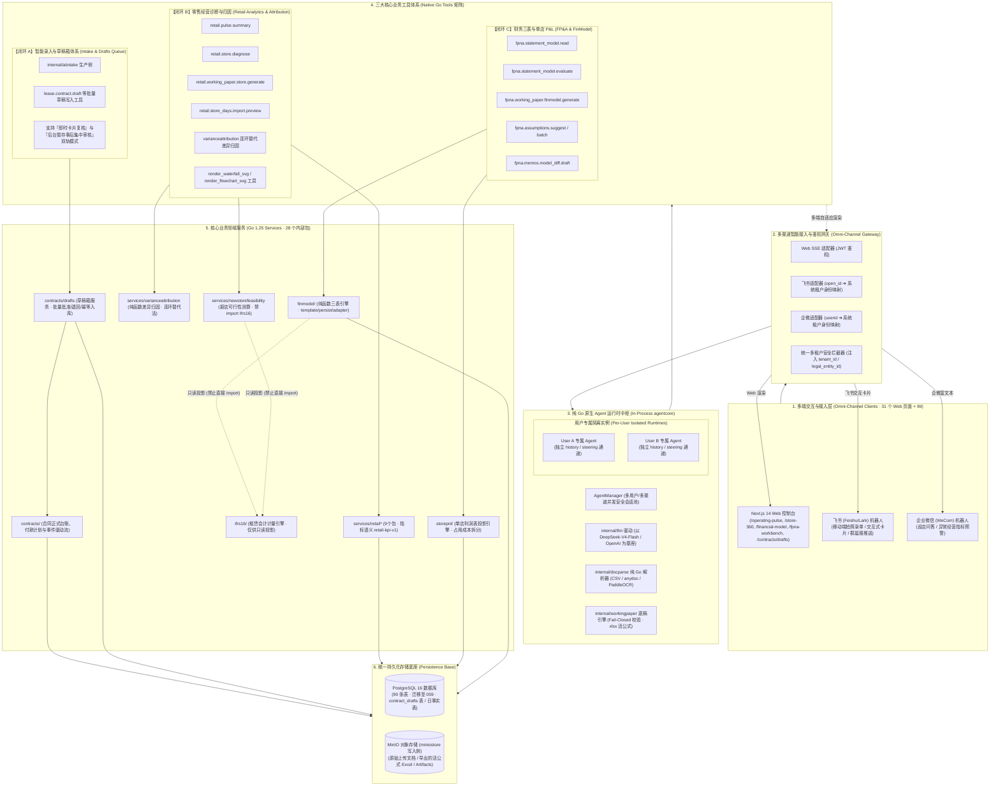

# 线下零售经营分析工作站 · 智能体系统架构全景蓝图 (Architecture Blueprint)

> **核心参考源与基线（2026-08 最新版本 · R批次）**：
> - 🌟 **智能体架构核心参考**：[sipeed/picoclaw (GitHub 官方仓库)](https://github.com/sipeed/picoclaw)
> - 📱 **PicoClaw 管理客户端**：[sipeed/picoclaw_fui (GitHub 官方仓库)](https://github.com/sipeed/picoclaw_fui)
> - 🏬 **企业零售工作站目标系统**：[CHEUKFUNGWU/retail_performance_workstation (GitHub 目标仓库)](https://github.com/CHEUKFUNGWU/retail_performance_workstation)
> - 遵循 ADR-0023/0024 架构决议，**全面退役并移除 Python `ai-service`**，实现 **100% 纯 Go 1.25 进程内原生智能体架构 (28 个内部包)**。
> - 集成「智能录入与异步草稿箱 (Intake & Drafts Queue)」、「零售经营诊断与差异归因 (Retail Pulse & Variance Attribution)」、「财务三表模型 & 单店利润表 (FP&A & FinModel)」三大业务闭环。
> - 配备 **「SVG 动态矢量可视化与流程图引擎」** 与 **「多渠道 IM 智能网关 (Web / 飞书 / 企业微信)」**。

---

## 🏛️ 一、 整体系统全景拓扑图 (Overall System Topology)



---

## 🔄 二、 闭环 A 深度升级：智能录入与草稿箱双轨复核体系 (Dual-Track Review)

针对用户在不同业务场景下的节奏需求，系统提供 **「即时对话卡片核对」** 与 **「异步批量暂存 · 事后集中复核」** 两种互通的工作模式：

```
                              [ 用户上传文档 (支持单份/多份批量) ]
                                                │
                                                ▼
                             ┌─────────────────────────────────────┐
                             │  纯 Go docparse 提取 + AI 字段抽取   │
                             │  (自动计算置信度与缺失项标记)         │
                             └──────────────────┬──────────────────┘
                                                │
                                                ▼
                             ┌─────────────────────────────────────┐
                             │  Tool: 批量自动写入 `contract_drafts`│
                             │  (status = 'pending_review')        │
                             └──────────────────┬──────────────────┘
                                                │
                     ┌──────────────────────────┴──────────────────────────┐
                     ▼                                                     ▼
     【模式 1：即时少量复核 (Chat View)】               【模式 2：批量/事后集中复核 (Workbench View)】
  • 适用：用户当前不赶时间，只传了 1~2 份文档        • 适用：用户赶时间，或批量上传了 10+ 份合同
  • 表现：在 /ai-chat 窗口内直接渲染 Artifact 卡片   • 表现：Chatbot 仅返回一行提示与批量草稿入口
  • 操作：在对话流中直接点击 [确认创建]              • 核心页面：前往 `/contracts/drafts` 集中工作台
                                                                           │
                                                                           ▼
                                                 ┌─────────────────────────────────────────┐
                                                 │ 🖥️ 前端「草稿复核中心」(/contracts/drafts)│
                                                 │ • 列表展示所有待审草稿（状态/置信度/缺失项） │
                                                 │ • 双栏对照：左边看 PDF 原件，右边修字段  │
                                                 │ • 支持【一键批量批准】与【随手存盘离开】   │
                                                 │ • 批准后触发正式入库，流转审批过账流程    │
                                                 └─────────────────────────────────────────┘
```

---

## 🔒 三、 多用户独立运行时与生命周期管理 (Per-User Agent Runtime)

为彻底杜绝多用户数据串味、竞态冲突与打断误杀，Go 内存中严格为每个会话维持独立的 Agent 实例生命周期：

```
[ 用户请求: Header 带 JWT (含 legal_entity_id) + session_id ]
                            │
                            ▼
           ┌──────────────────────────────────┐
           │     AgentManager.GetOrCreate()   │
           └────────────────┬─────────────────┘
                            │
             ┌──────────────┴──────────────┐
       [内存存在 (Hot State)]         [内存不存在 (Cold State)]
             │                             │
             ▼                             ▼
    更新 last_active 活跃时戳      从 PostgreSQL 读取该 Session 历史记录
             │                             │
             │                     实例化全新独立 PicoAgent 结构体
             │                     (挂载 internal/llm + 专属工具集)
             │                             │
             └──────────────┬──────────────┘
                            ▼
    ┌────────────────────────────────────────────────────────┐
    │              专属 UserAgentRuntime 实例                 │
    │  • 专有 history: 仅包含该用户当前会话上下文               │
    │  • 专有 steeringCh: 仅接收该用户的实时纠偏打断信号         │
    │  • 强制绑定 legal_entity_id: 数据库层强制行级过滤        │
    │  • 专属权限工具集: 自动注入 caller 权限的 47+ 个工具       │
    └────────────────────────────────────────────────────────┘
```

---

## 🔄 四、 另外两大业务闭环工作流

### 【闭环 B】门店零售经营诊断与差异归因 (Retail Analytics & Variance Attribution)
> 对应模块：`services/retail*` (9个包 · `retail-kpi-v1`) + `services/varianceattribution` ➔ `/operating-pulse`, `/store-360`, `/scenario-workbench`

```
1. 用户提问: "帮我分析华东区上个月利润波动最大的门店及其归因？"
      │
      ▼
2. Agent 触发 Tool: retail.store.diagnose + varianceattribution
      │
      ▼
3. Go 工具执行精确连环替代法 (Successive Substitution):
   • 中间值序列逐格锁定，望远镜和恒等于总差异
   • 严密拆解：客流贡献、转化率贡献、客单价贡献与固定租金占用侵蚀
      │
      ▼
4. LLM 组织事实因果推演 + 动态生成【四墙利润贡献变化瀑布图 SVG】
      │
      ▼
5. 产出结构化报告 + 带参深度链接: [一键进入情景工作台模拟减租方案 ➔ /scenario-workbench?store_id=SH-001]
```

---

### 【闭环 C】通用企业级 FP&A 财务三表、自定义科目与版本化底稿引擎 (Generic FP&A & Working Paper Engine)
> 对应模块：`internal/finmodel/` + `internal/workingpaper/` + `internal/storepnl/` ➔ `/store-pnl`, `/financial-model`, `/fpna-workbench`

```
                     ┌─────────────────────────────────────────────────────────┐
                     │ 🌐 通用三表财务引擎内核 (Generic Pure-Function finmodel) │
                     │ • 资产负债表平衡 (资产 = 负债 + 权益)                    │
                     │ • 现金流量表间接法配平 (经营/投资/筹资)                  │
                     │ • 16 项标准勾稽自动核验 (T1~T16 杜绝平衡表悬空)         │
                     │ • 支持 12~36 个月滚动预测 (Rolling Forecast) 与多情景    │
                     └────────────────────────────▲────────────────────────────┘
                                                  │
             ┌────────────────────────────────────┼────────────────────────────────────┐
             │            三类即插即用数据接入模式 (由用户自由选择)                   │
             ▼                                    ▼                                    ▼
  【模式 1: 纯手工自由填报】            【模式 2: Excel 底稿导入】           【模式 3: 系统按需一键挂载】
  • 适用: SaaS/制造/餐饮/跨行业         • 适用: 已有完整科目表的财务团队     • 适用: 本系统零售/租赁客户
  • 自由设定收入增长率、毛利率          • 上传历史余额表与 P&L               • 按需勾选：从系统自动带入
  • 自定义人均薪酬与招聘计划            • 自动解析为期初与假设集               60 家门店 IFRS 16 租赁数据
```

#### 1. 自定义会计科目树与 AI 自动生成 (Custom COA & AI Generator)
*   **自由树状科目管理**：用户可自由增删改任意一/二/三级科目（如“SaaS 订阅收入”、“云服务成本”、“跨境物流关税”、“研发期权薪酬”）。
*   **AI 一键生成行业专属科目表 (`fpna.coa.suggest_template` 工具)**：输入行业类型（如出海电商、连锁餐饮），AI 一键生成专属科目树与标准驱动假设。

#### 2. 模型多版本管理与工作底稿不可篡改归档 (Versioning & Working Papers)
```
  [ 模型版本树 (Model Versions) ]
   ├── v1.0 (2027 Budget - Official Approved 官方基准版)
   ├── v1.1 (2027 Q1 Rolling Forecast - Base Case 中性滚动预测)
   ├── v1.2 (2027 Q1 - Aggressive Expansion / Bull Case 激进扩张版)
   └── v1.3 (2027 Q1 - Supply Chain Crisis / Bear Case 供应链压力版)
```
*   **完整快照持久化 (Snapshot)**：每次运行（Run）固化当前科目的 AST 公式、期初数据、假设参数与计算结果。
*   **不可篡改工作底稿 (Working Paper Artifact)**：通过 T1~T16 全绿校验后，自动签发底稿，并导出包含完整 Excel 公式的 `.xlsx` 文件存入 MinIO。
*   **跨版本差异对比备忘录 (`fpna.memos.model_diff.draft`)**：AI 自动对比 v1.1 vs v1.0，生成面向管理层的版本变动分析报告。

---

## 🎨 五、 SVG 动态矢量可视化与流程图引擎架构 (SVG Visualization Engine)

```
[ Go 业务 Tool / LLM 推理 ] ──(SSE 流式吐出 ```svg ...```)──► [ Next.js ReactMarkdown 代码块拦截器 ]
                                                                             │
                                                                             ▼
[ 矢量图形高清渲染 + Tooltip 悬浮 + 一键导出 .svg ] ◄──── [ SvgVisualizer 组件 (DOMPurify XSS 过滤) ]
```

---

## 📱 六、 多渠道 IM 智能网关架构 (Omni-Channel Agent Gateway: Web / 飞书 / 企微)

为了让店长巡店、法务移动办公和高管随时掌握经营动态，系统原生提供了基于 Go 的多渠道会话接入网关：

```
 ┌──────────────────────┐   ┌──────────────────────┐   ┌──────────────────────┐
 │ 1. Next.js Web 交互端 │   │ 2. 飞书 (Feishu/Lark)│   │ 3. 企业微信 (WeCom)  │
 └──────────┬───────────┘   └──────────┬───────────┘   └──────────┬───────────┘
            │ HTTP / SSE               │ Webhook Event            │ XML/JSON 回调
            ▼                          ▼                          ▼
 ┌────────────────────────────────────────────────────────────────────────┐
 │            多渠道接入与身份解析网关 (Omni-Channel Gateway)              │
 │                                                                        │
 │   • WebAdapter: JWT 认证 ➔ 提取 legal_entity_id / user_id              │
 │   • FeishuAdapter: 飞书 open_id ➔ 映射系统内部用户与法人租户           │
 │   • WeComAdapter: 企微 UserID ➔ 映射系统内部用户与法人租户             │
 └──────────────────────────────────┬─────────────────────────────────────┘
                                    │ 统一转为 Canonical Inbound Message
                                    ▼
 ┌────────────────────────────────────────────────────────────────────────┐
 │        AgentManager 统一会话中枢 (为飞书/企微/Web 维持独立 Session)     │
 │                                                                        │
 │   • 共享所有业务工具库: lease.* / retail.* / fpna.*                    │
 │   • 共享底层数据与安全底线 (跨法人隔离、零直接脏写、底稿 Fail-Closed)     │
 └──────────────────────────────────┬─────────────────────────────────────┘
                                    │ 生成统一分析结果与决策方案
                                    ▼
 ┌────────────────────────────────────────────────────────────────────────┐
 │            自适应多端卡片渲染器 (Multi-Channel Card Renderer)          │
 │                                                                        │
 │   • 投递给 Web ──► 渲染 Next.js Artifact 卡片 + 动态 SVG 瀑布图         │
 │   • 投递给飞书 ──► 渲染飞书 Schema 2.0 交互式卡片 (带一键审批 Action)   │
 │   • 投递给企微 ──► 渲染企业微信 Markdown 模板卡片 (带外链直达)          │
 └────────────────────────────────────────────────────────────────────────┘
```

---

## 🛡️ 七、 九大不可突破的架构与合规底线 (System Guardrails)

| 规则 # | 底线名称 | 架构落地机制与代码守卫 |
| :---: | :--- | :--- |
| **1** | **跨法人物理隔离** | 所有 Tool 执行强制从 Context 提取 `legal_entity_id`，底层 SQL 强制 `WHERE legal_entity_id = ?`，杜绝跨租户串写。 |
| **2** | **模拟/正式数据物理隔离** | 固定 seed 模拟数据全程带有 `is_simulated = true` 标签，**永不进入 Official 过账链路**，simulated 的 run 严禁 publish 为正式计划版本。 |
| **3** | **草稿箱缓冲与零直接脏写** | AI 识别生成的所有草稿**100% 写入 `contract_drafts` 暂存隔离层**，允许用户事后集中复核，严禁直接篡改正式租赁台账与 IFRS 16 资产负债表。 |
| **4** | **财务三表与新店测算解耦** | `finmodel` 与 `newstorefeasibility` **双双严禁 import `ifrs16`**（由 import guard 遍历全部子包锁死），租赁与 ROU 只经只读 Port 读取。 |
| **5** | **底稿生成 Fail-Closed 闸门** | 财务模型若未通过 T1~T16 全部勾稽断言，`workingpaper/lint.go` 的 `tie_out_unpassed` 规则**直接拒绝产出底稿 Artifact**，防止带病过账。 |
| **6** | **口径冲突只降级不换算** | 数值在展示语境下要么可用、要么显示「—」加原因，**绝不反推事实**（缺 `labor_hours` 即为 nil，不许用时薪倒推），中文名唯一真相源为 `retailkpi`。 |
| **7** | **前端不复刻后端 DSL 校验** | 前端不做本地公式解析，公式校验一律走 `POST /api/v1/financial-model/templates/validate`，复用后端 AST 路径。 |
| **8** | **多渠道身份可信映射** | 飞书/企微 Webhook 必须经过签名与企业秘钥解密，严格按绑定映射表提取内部 `legal_entity_id`，杜绝仿冒身份越权。 |
| **9** | **SVG 前端 XSS 防御** | 所有 AI 生成的动态 SVG 代码块必须经过 `DOMPurify` 严格消毒，剥离 `<script>` 与内联事件，杜绝脚本注入。 |

---

## 📁 八、 项目真实工程代码目录映射表 (Codebase Layout)

```text
retail_performance_workstation/
├── db/                                 # PostgreSQL 数据库底座
│   ├── init/01_init.sql                # 90 张业务表初始化基线 (含 contract_drafts 表)
│   └── migrations/                     # 增量迁移 SQL (已推进至 059_*.sql)
├── core-service/                       # 100% 纯 Go 1.25 核心后端 (28 个内部包)
│   ├── cmd/
│   │   ├── api/main.go                 # HTTP API 入口 (初始化 AgentManager 与路由)
│   │   ├── ifrs16-regression/          # IFRS 16 回归报告生成命令
│   │   ├── lease-agent/                # 只调用 Agent Gateway 的 CLI Adapter
│   │   └── agent-runner/main.go        # Pi-like Worker 独立工作进程 (无 DB/MinIO 直接凭证)
│   └── internal/
│       ├── gateway/                    # 多渠道 IM 智能网关 (Web/飞书/企微)
│       │   ├── channel_manager.go      # 统一渠道生命周期与消息总线
│       │   ├── feishu_adapter.go       # 飞书开放平台 Webhook 事件监听与卡片回复
│       │   ├── wecom_adapter.go        # 企业微信回调解密与模板卡片推送
│       │   └── card_renderer.go        # 多端自适应卡片生成器 (Schema 2.0 / Markdown)
│       ├── agentcore/                  # 纯 Go Agent 循环内核 (ADR-0022)
│       ├── agentartifact/              # Artifact / Evidence 证明协议
│       ├── agentskill/                 # Skill Registry 规范
│       ├── agenttools/                 # 47+ 个原生 Tool (lease.* / retail.* / fpna.* / svg.*)
│       │   ├── intake_draft_tool.go    # 【闭环 A】合同/对账批量草稿生成工具
│       │   ├── svg_chart_tool.go       # SVG 瀑布图与流程图生成器
│       │   ├── store_diagnose_tool.go  # 门店 360 诊断取数工具
│       │   └── fpna_model_tools.go     # 三表模型与 FP&A 评估工具
│       ├── agentseval/                 # L1 评测 harness 与不变量用例
│       ├── llm/                        # 进程内 LLM 驱动 (DeepSeek-V4-Flash / OpenAI 直连)
│       ├── docparse/                   # 纯 Go CSV / anydoc / PaddleOCR 解析层
│       ├── aiintake/                   # 智能录入与字段抽取服务
│       ├── workingpaper/               # 审计底稿引擎、单元格级 provenance、Fail-Closed 校验与 xlsx 活公式渲染
│       ├── miniostore/                 # MinIO 对象存储读写适配器
│       ├── storepnl/                   # 单店利润表投影、占用成本拆分、活公式 xlsx
│       ├── finmodel/                   # 通用三表模型：纯函数引擎 + 勾稽 T1–T16
│       │   ├── engine.go               # 纯函数模型计算
│       │   ├── template/               # 模板值对象与白名单公式 DSL
│       │   ├── opening/                # 期初三道闸核验
│       │   ├── persist/                # 唯一写入口、发布谱系、勾稽落队列
│       │   ├── adapter/                # 外部生产端口 (事实 / 计量 / 付款计划 / TB)
│       │   ├── suggestion/             # AI 假设草稿 (draft-only)
│       │   ├── memo/                   # 四层版本差异备忘录
│       │   ├── importguard_test.go     # 架构守卫: 严禁 import ifrs16
│       │   └── writeguard_test.go      # 单写入口守卫
│       ├── services/                   # 业务领域服务 (28 个内部服务包)
│       │   ├── contracts/drafts/       # 【闭环 A】集中草稿箱管理服务 (批量批准/流转)
│       │   ├── retailkpi/              # retail-kpi-v1 统一指标语义层 (唯一中文名真相源)
│       │   ├── retailpulse/            # 经营脉搏聚合
│       │   ├── retailstore360/         # 门店 360 与同群对比
│       │   ├── retailscenario/         # 确定性情景计算 (七杠杆 What-if)
│       │   ├── varianceattribution/    # 👈 【新增】利润差异归因 (连环替代法 · 纯函数)
│       │   ├── newstorefeasibility/    # 👈 【新增】新店可行性测算 (纯函数 · 严禁 import ifrs16)
│       │   ├── promotionattribution/   # 👈 促销归因与投前保本测算 (RunRate)
│       │   ├── retailsimulation/       # 固定 seed 模拟数据生成器
│       │   ├── ifrs16/                 # IFRS 16 会计计量引擎
│       │   └── contracts/              # 合同正式台账与事件流
│       ├── repository/                 # pgx 高性能数据访问层 (手写 SQL)
│       ├── middleware/                 # JWT、tenant_id 多租户隔离、CORS
│       └── handlers/
│           ├── agent_chat_handler.go   # /api/v1/ai/chat (SSE 流式输出)
│           ├── webhook_handler.go      # /api/v1/webhook/:channel (飞书/企微 Webhook 入口)
│           ├── contract_draft_handler.go # /api/v1/contracts/drafts (草稿箱管理接口)
│           └── retail_*.go             # 零售各业务线 HTTP 接口
├── contracts/ai-intake.v1/             # 抽取契约 JSON Schema (契约不变，实现可换)
├── web/                                # Next.js 14 + TypeScript 前端 (31 个页面)
│   └── app/
│       ├── components/
│       │   └── ai/
│       │       └── SvgVisualizer.tsx   # 动态 SVG 安全渲染与一键导出组件
│       ├── contracts/
│       │   ├── drafts/page.tsx         # 【闭环 A 核心】集中草稿复核工作台 (双栏对比/批量批准)
│       │   └── page.tsx                # 合同正式台账
│       ├── operating-pulse/            # 经营脉搏
│       ├── store-360/                  # 门店 360 诊断
│       ├── scenario-workbench/         # 情景工作台
│       ├── store-pnl/                  # 单店利润表
│       ├── financial-model/            # 三表模型工作台
│       ├── fpna-workbench/             # FP&A 版本与差异工作台
│       ├── ai-chat/                    # 智能助手对话 (带 SVG 图表与草稿快速入口)
│       ├── monthly-closing/            # 月结跑批
│       └── reports/                    # 报表中心
├── docs/                               # 需求规格、ADR 决策、架构与运维手册
├── Makefile
└── AGENTS.md                           # 开发约束与架构规范
```
